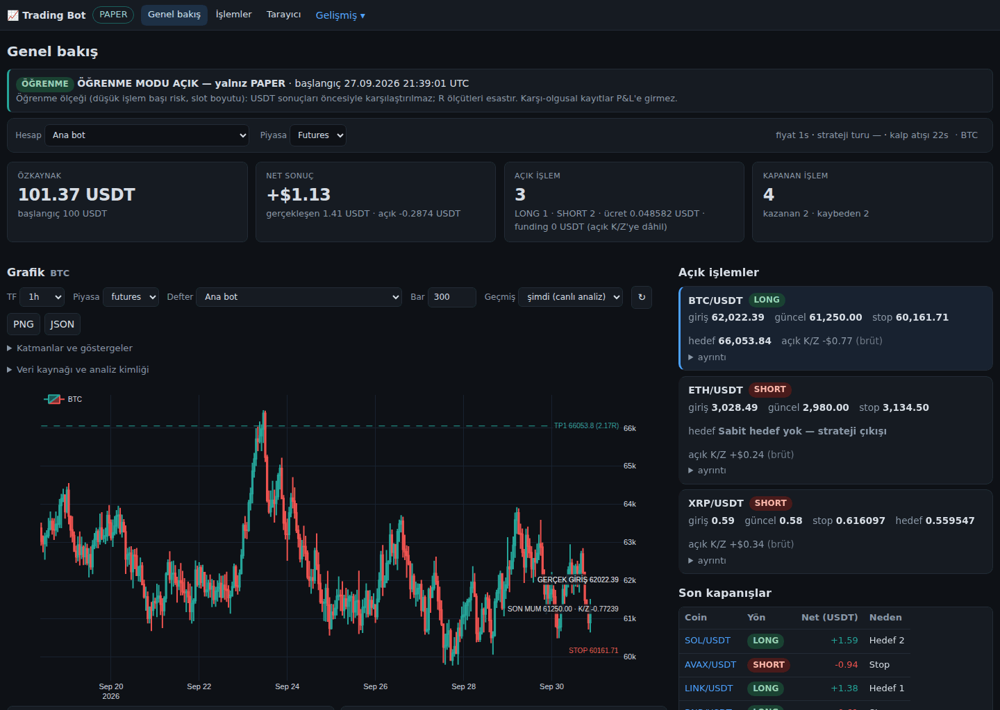
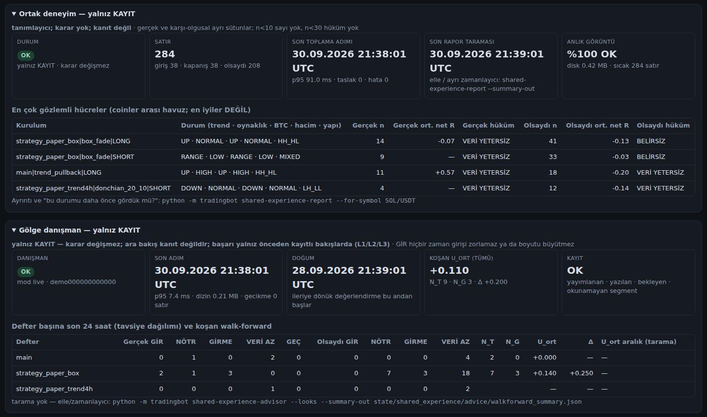
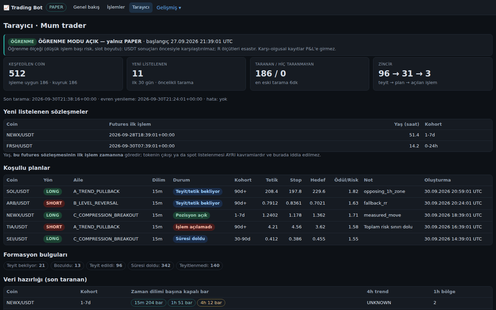
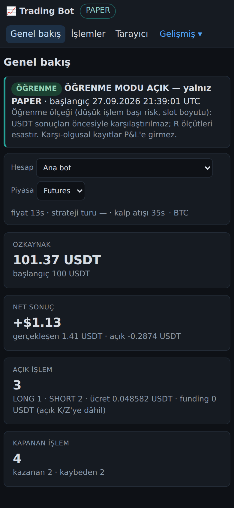
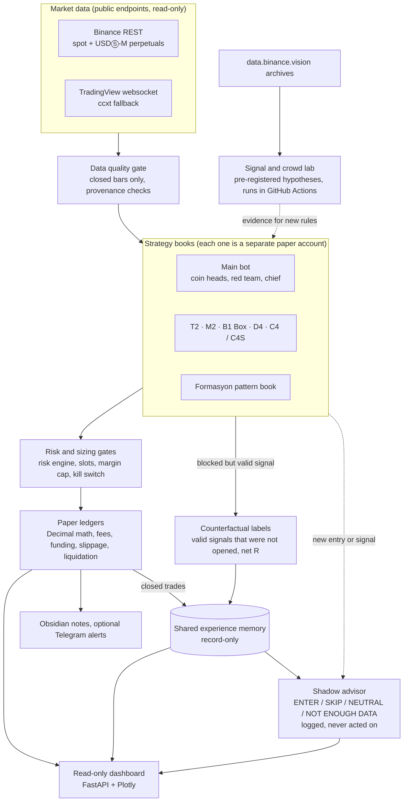

# trading2 — Paper-Trading Research Bot for Binance Futures

A 24/7 research bot that runs eight crypto strategy books side by side **with simulated (paper) money only**, records every trade and every signal it did *not* take, and measures after fees, funding and slippage what actually worked.

[](https://github.com/CoskunerBerke/trading2/actions/workflows/chart-analysis.yml)


> **Important:** this bot never sends real orders and needs no exchange API keys. All results are paper-only
> (simulated), and so far they are **statistically inconclusive**. Nothing in this repository is financial advice.

> **Branches:** `main` holds the development line the author's paper bot is deployed from (developed in
> [pull request #1](https://github.com/CoskunerBerke/trading2/pull/1)). Some other branches hold older snapshots (for
> example the early v2 multi-coin bot) or finished experiments.



*Read-only dashboard, main paper book (the UI is in Turkish). **Synthetic demo data, paper only**: generated by
[`scripts/demo_panel_state.py`](scripts/demo_panel_state.py), not real trades or real results.*

## Contents

[Overview](#overview) · [Features](#features) · [How it works](#how-it-works) · [Screenshots](#screenshots) ·
[Architecture](#architecture) · [Research results so far](#research-results-so-far) · [Tech stack](#tech-stack) ·
[Project structure](#project-structure) · [Quick start](#quick-start) · [Configuration](#configuration) ·
[Testing](#testing) · [Deployment](#deployment) · [Security](#security) · [Status and roadmap](#status-and-roadmap) ·
[Documentation](#documentation) · [Türkçe](#türkçe)

## Overview

trading2 is a personal research project by a computer-engineering student. It watches Binance spot and USDⓈ-M
perpetual futures markets, lets several independent strategy "books" open simulated positions, and keeps an append-only
record of every trade and of every valid signal that was *not* taken. The goal is not to promise returns but to answer
an honest question with data: *"In this situation, with this setup, did we win or lose before, after fees, funding and
slippage?"*

What makes it more than a toy bot:

- **Honest measurement.** Accounting uses `Decimal` math with Binance's own order filters, fees, funding settlements and
  liquidation rules. Missed signals are labelled with the same cost model ("counterfactuals"), so the bot learns from
  trades it could not open, too.
- **Research discipline.** Newer rules (the C4 candle variations, the Formasyon v3 signal) and every crowd-data idea go
  through a signal lab that tests hypotheses registered and hash-sealed *before* the data is looked at, with
  discovery/validation splits, bootstrap confidence intervals and placebo signals. A rule that fails is either dropped or
  kept clearly labelled as observation only.
- **Fail-closed by design.** PAPER is the only mode that can trade; the live order path is disabled in code. Bad data,
  unknown state formats or missing prices stop an action instead of guessing.
- **Runs 24/7.** systemd units with hardening, backups with checksums, versioned deploy scripts with automatic rollback,
  health checks and a read-only web dashboard.

At a glance (counted from this repository): about 131,000 lines of Python in `tradingbot/` (314 modules),
**4,853 automated tests** in 263 test files that run offline, and 60+ design documents and research notes in `docs/`
(mostly Turkish).

## Features

- **Eight paper strategy books**, each with its own simulated balance and ledger (the main bot keeps a futures and a
  spot ledger):
  - **Main bot:** multi-agent decisions: per-coin specialists (volatility, trend, candles, volume, support/resistance,
    momentum, historical analogs, live market data) → coin head → red team → chief → deterministic global risk engine.
  - **T2** EMA200 trend regime · **M2** 28-day time-series momentum · **B1 Box** fade of the previous day's range on
    5-minute bars · **D4** Donchian 20/10 trend on 4h (observation only: it did not pass the lab's strict test) ·
    **C4 / C4S** 4h candle variations (sealed definitions).
  - **Formasyon** pattern book: currently protocol v3, a 4h "three white soldiers" + RSI14 > 70 long signal, the only
    candidate out of 1,412 combinations that passed the signal lab's strict test ([details](docs/PATTERN_TRADER_V3.md)).
- **Realistic paper accounting:** taker fees, funding at the exchange's settlement times, slippage, tick/step/min-notional
  filters, isolated margin and liquidation checks, one position per symbol per book.
- **Learning mode (paper only, enabled in the committed config):** relaxes capacity limits (total open-risk cap,
  position-count and margin bottlenecks) and some selectivity gates so every book collects more R-multiple experience,
  at a smaller risk per trade. Under it the main bot also opens negative-edge candidates as tagged exploration trades.
  Limits that protect measurement quality (data identity, stop geometry, double counting, exchange filters) stay.
  Results are compared in R, not in USDT, and policy trades are reported separately from learning-extra ones.
- **Counterfactual labels:** every valid signal that could not be opened is stored and later labelled with closed bars and
  the ledger's own cost model (net R, versioned labels).
- **Shared experience memory:** one record-only store of real trades and counterfactuals with a market-situation snapshot
  (trend, volatility, BTC regime, volume, structure), pooled across coins and books.
- **Shadow advisor:** logs ENTER / SKIP / NEUTRAL / NOT ENOUGH DATA for each new entry and signal, but **never changes a
  decision** (tests compare decisions with the advisor on and off). It is judged only at pre-registered evaluation dates.
- **Signal and crowd labs:** candle/chart signals and crowd data (open interest, long/short ratios, taker flow, funding) are
  tested on `data.binance.vision` archives inside GitHub Actions.
- **Read-only web dashboard** (FastAPI + locally served Plotly): 18 HTML pages (16 in the navigation plus coin and trade
  detail pages), a JSON API, `/health/live`, `/health/ready`, Prometheus `/metrics` and server-sent events. It has no write
  endpoints.
- **Obsidian vault output:** canvas diagrams and Markdown notes for coins, agents, signals and lessons.
- **Operations:** `doctor` and `preflight` checks, singleton lock, persistent kill switch, cooperative stop, verified
  backups and restore, optional Telegram/Discord alerts, bot scorecard (`scripts/bot_scorecard.py`).

## How it works

One worker process (`python -m tradingbot watch`) runs a *tour*, waits 15 minutes after it ends, and repeats; one
recorded production tour took about 24 minutes, so the main bot decides roughly every 39 minutes. A tour loads
closed-bar USDⓈ-M perpetual frames for a fixed 40-coin universe and binds each frame's provenance to that tour. Every
book then decides on closed bars only, and a symbol whose perpetual frames cannot be verified for that tour gets no new
futures entry (the main bot's spot buys are not gated by this check or by the universe).

- **Main bot:** per-coin specialists → coin head (plan and expected R) → red team (only real safety problems reject) →
  chief (ranking, bounded soft penalties) → global risk engine, which checks the *final* size before the paper ledger
  opens anything. Candidates are ranked by a conservative after-cost edge: expected net R minus an uncertainty penalty
  and soft penalties.
- **Single-rule books:** T2, M2, Box, D4 and C4/C4S are pure rule functions over closed bars that share one executor; the
  Formasyon book has its own background scanner.
- **Learning mode is on in the committed config**, so these are the rules actually running:
  - every book except C4S sizes from equal slots at 0.5% risk;
  - learning-extra entries are split by cause (since 2026-10-03, `learning_mode.extra_entries: record_selectivity`): an
    entry that only an account/book capacity limit or an order-size rule would have stopped (total open risk, position
    count, margin, minimum order) opens for real; an entry the baseline rules would reject as a signal (negative edge,
    research size, regime gate, candle veto, blocking structure, leverage NO_TRADE, book universe, Formasyon's R/R floor,
    or any unclassified code) is not opened and is recorded as a counterfactual with reason `LEARNING_RECORD_ONLY`;
    `extra_entries: open` switches back;
  - the main bot still evaluates its regime gate, candle veto and blocking structure decisions in shadow, but a candidate
    they would block is recorded instead of opened;
  - Box accepts stops down to 0.5% (0.32% until 2026-10-03) and those entries open for real; D4 and C4 scan the whole
    universe, but entries outside their own lab coins are recorded only.
- **Time-critical work runs off the tour:** a protective monitor thread checks every open futures position about once a
  minute against a verified perpetual mark, and a Box timer thread evaluates each closed 5-minute candle. The main bot's
  spot holdings have no stop orders, are not monitored and are never sold by the worker (a known gap).
- **One accounting model:** `Decimal` paper ledgers (isolated margin for futures) with taker fees, 3 bps slippage,
  exchange filters, realised funding settlements and a prudent order when a bar crosses both the stop and the
  liquidation price.
- **Evidence without feedback:** valid signals that could not be opened are labelled later in net R; the shared
  experience store and the shadow advisor record everything and do not change decisions.

The full explanation, with diagrams, formulas, design trade-offs, test counts and a code tour, is in
**[docs/HOW_IT_WORKS.md](docs/HOW_IT_WORKS.md)**; [docs/README.md](docs/README.md) indexes all documents in English.

## Screenshots

All screenshots show **synthetic demo data, paper only** (`python scripts/demo_panel_state.py`): the candles are a seeded
random walk and the demo ledgers are replayed on it with the real accounting code. They are not real trades or results.

| Shared experience memory and shadow advisor | Scanner of the Formasyon book (demo plans use the earlier 15m "classic" protocol) | Phone (390 px) |
|---|---|---|
|  |  |  |

## Architecture



1. **Data.** Candles and prices come from public endpoints only. Every decision uses closed bars, and each frame carries
   its provenance (market, timeframe, last closed bar) so the dashboard can show exactly what a decision saw.
2. **Books.** Each book decides independently and keeps its own paper account; nothing is pooled between them.
   The main bot's orchestration lives in `TradingEngineV3.tour()` ([`tradingbot/engine_v3.py`](tradingbot/engine_v3.py)).
3. **Gates and ledgers.** Sizing is risk-based (loss at the stop, not leverage, sets the size). The ledgers
   ([`tradingbot/accounting/`](tradingbot/accounting)) apply exchange filters, fees, funding and liquidation.
4. **Evidence.** Counterfactual labels, the shared experience memory and the shadow advisor are record-only layers:
   they feed reports and the dashboard, not the decision path.

More detail: [docs/ARCHITECTURE.md](docs/ARCHITECTURE.md) (overall flow and packages),
[docs/PAPER_ACCOUNTING.md](docs/PAPER_ACCOUNTING.md), [docs/RISK_POLICY.md](docs/RISK_POLICY.md),
[docs/ogrenme_modu/SPEC.md](docs/ogrenme_modu/SPEC.md) (learning mode),
[docs/ortak_deneyim/SPEC_V1.md](docs/ortak_deneyim/SPEC_V1.md) (shared experience) and
[docs/ortak_deneyim/DANISMAN_V1.md](docs/ortak_deneyim/DANISMAN_V1.md) (shadow advisor).

## Research results so far

These are backtests on historical data and are documented, with their run IDs, in the linked notes. They are not a
promise of future results.

- **Signal lab** ([docs/PATTERN_TRADER_V3.md](docs/PATTERN_TRADER_V3.md)): 30 coins, 4 years of 4h and 2 years of 1h data,
  about 1.1 million simulated trades. Classic candle and chart patterns (hammer, engulfing, triangles, flags,
  head and shoulders, double tops/bottoms) showed **no reliable edge after costs**. On short timeframes costs dominate
  (about 0.43 R per trade on 15m and 0.83 R on 5m). One combination out of 1,412 passed the strict test and is now
  paper-traded; with that many trials it may still be luck.
- **Crowd lab** ([docs/CROWD_LAB_FUT_V2.md](docs/CROWD_LAB_FUT_V2.md)): 16 pre-registered hypotheses on open interest,
  long/short ratios, taker flow and funding (two sealed families). **None qualified as a candidate.**
- **Live paper books:** still collecting data; so far statistically inconclusive.

## Tech stack

| Area | Tools |
|---|---|
| Language | Python 3.12 (the code uses 3.12-only f-string syntax) |
| Data and math | pandas, NumPy, PyArrow (Parquet), `Decimal` accounting |
| Market data | Binance public REST and `data.binance.vision` archives, ccxt, TradingView websocket (read-only) |
| Web and API | FastAPI, Uvicorn, Pydantic, Plotly |
| Charts and notes | Matplotlib, Obsidian (Markdown + canvas) |
| Quality | pytest, Ruff, GitHub Actions |
| Deployment | systemd units, versioned deploy scripts, Docker / Docker Compose |

## Project structure

```text
tradingbot/
├── engine_v3.py, cli_v3.py      # main engine and command-line interface (python -m tradingbot ...)
├── strategy_paper.py            # strategy books T2, M2, B1 Box, D4, C4 / C4S
├── pattern_trader/              # Formasyon pattern book
├── accounting/                  # futures/spot ledgers, fees, funding, liquidation, exchange filters
├── risk/                        # risk engine, profiles, operating modes, kill switch
├── coinhead/, agents/           # per-coin specialists, red team, chief
├── learning_mode.py, learning_cf.py   # learning mode and counterfactual recorder
├── shared_experience/           # shared experience memory, report and shadow advisor
├── learn/, quant/, replay/      # labels, journals, evaluation, historical replay
├── signal_lab.py, crowd_lab.py  # research labs with pre-registered hypotheses
├── market/, history/            # Binance providers, rate budget, data quality, archive collector
├── dashboard/                   # read-only FastAPI dashboard
└── ops/, notify/                # doctor, backups, locks, stop, alerts
scripts/                         # scorecard, forensics, signal lab runner, demo dashboard state
tests/                           # pytest suite (offline, synthetic data)
docs/                            # architecture, policies, research notes, review evidence
deploy/                          # systemd units, Docker Compose, env template, release scripts
research/                        # research inputs and archived lab outputs
Trading_bot/                     # sample Obsidian vault written by the bot
```

## Quick start

Requires **Python 3.12**. These commands were run on Linux from a fresh clone. On Windows use
`py -3.12 -m venv .venv`, `.venv\Scripts\activate` and `set` instead of `export`; the `scripts\*.bat` launchers wrap the
same `python -m tradingbot` commands for an activated environment (the Windows steps were not re-run for this README).

```bash
git clone https://github.com/CoskunerBerke/trading2.git
cd trading2

python3.12 -m venv .venv && source .venv/bin/activate
pip install -r requirements.txt                   # dev tools: pip install -r requirements-dev.txt

# Keep state, market cache and the Obsidian vault under the git-ignored data/ folder.
# (config.yaml's default vault path is the author's Windows folder.)
export TRADINGBOT_DATA="$PWD/data"
python -m tradingbot doctor                       # environment / state / mode check (PAPER)
```

**Look at the dashboard without any network access** (synthetic demo data):

```bash
python scripts/demo_panel_state.py data/demo
TRADINGBOT_STATE_DIR=data/demo/state TRADINGBOT_CACHE_DIR=data/demo/data python -m tradingbot dashboard
# open http://127.0.0.1:8080
python scripts/bot_scorecard.py --state data/demo/state   # after-cost scorecard; every demo book: "VERİ YETERSİZ" (too few trades)
```

**Run the paper bot** (needs access to Binance's public API; if it is unreachable, the tour finishes without opening
anything and reports every symbol as `DATA_INVALID`):

```bash
python -m tradingbot tour                                   # one full tour
python -m tradingbot watch --interval 15 --scan-every 2     # run continuously
python -m tradingbot dashboard                              # read-only dashboard on http://127.0.0.1:8080
python scripts/bot_scorecard.py --state data/state          # after-cost scorecard of every book
```

`python -m tradingbot --help` lists all 60+ commands (status, replay, backtest, history collection, reports,
backup/restore, mode transitions, and more).

## Configuration

Settings live in [`config.yaml`](config.yaml): coin universe, books (`strategy_paper`, `pattern_trader`), risk profiles,
learning mode, shared experience, dashboard, Obsidian vault path. Risk-critical settings are validated on start-up and
the program refuses to start on an invalid value (for example, automatic model promotion in PAPER is rejected).

Environment variables (all optional; names only, never commit real values):

| Variable | Purpose |
|---|---|
| `TRADINGBOT_DATA` | Root folder for state, market cache, vault, backups and logs (server/Docker layout) |
| `TRADINGBOT_STATE_DIR`, `TRADINGBOT_CACHE_DIR`, `TRADINGBOT_VAULT_PATH`, `TRADINGBOT_LOG_DIR`, `TRADINGBOT_BACKUPS_DIR` | Override a single path |
| `TRADINGBOT_DASHBOARD_TOKEN` | Bearer token for the dashboard; required if it listens on anything other than loopback |
| `TELEGRAM_BOT_TOKEN`, `TELEGRAM_CHAT_ID`, `DISCORD_WEBHOOK_URL` | Operational alerts (`tradingbot/ops/notify.py`) |
| `TRADINGBOT_TELEGRAM_BOT_TOKEN`, `TRADINGBOT_TELEGRAM_CHAT_ID` | Trade event notifications (`telegram` section in `config.yaml`) |
| `TRADINGBOT_LEARNING_MODE`, `TRADINGBOT_SHARED_EXPERIENCE`, `TRADINGBOT_SHARED_EXPERIENCE_ADVISOR` | Set to `off` to switch a layer off (they can only switch off, never on) |
| `ANTHROPIC_API_KEY` | Optional LLM research layer (off by default, `llm.provider: noop`); it can never open trades |
| `BINANCE_TESTNET_SPOT_KEY`, `BINANCE_TESTNET_SPOT_SECRET`, `BINANCE_TESTNET_FUTURES_KEY`, `BINANCE_TESTNET_FUTURES_SECRET` | Testnet gateways only (not used in PAPER) |
| `ALLOW_LIVE_TRADING` | Keep unset or `false`; the live gateway is disabled in this version anyway |

Note: [`deploy/env.example`](deploy/env.example) still lists a few older names that the code does not read
(`DASHBOARD_TOKEN`, `DASHBOARD_HOST`, `DASHBOARD_PORT`, `BINANCE_TESTNET_API_KEY`/`_SECRET`,
`BINANCE_TESTNET_SPOT_API_KEY`/`_SECRET`, `LLM_DAILY_BUDGET_USD`). Use the names in the table above.

## Testing

```bash
pip install -r requirements-dev.txt
python -m pytest -q tests          # full suite, offline (about 20 minutes)
ruff check .                       # lint gate defined in ruff.toml
```

- The full suite has **4,853 tests** (collected 2026-10-08). Last full run, 2026-10-03 (4,213 tests then) on a shared
  4-core Linux machine: 4,205 passed, 8 skipped,
  in about 22 minutes. The skipped tests need the author's local research package or archive files, an opt-in benchmark
  (`TRADINGBOT_BENCH_1M=1`), or a fixture case that did not come up in that run.
- Tests need no network: exchanges, Telegram and archives are faked, and an autouse fixture in
  [`tests/conftest.py`](tests/conftest.py) makes the bot's HTTP client and the engine's ccxt exchange fail at once when a
  test did not give them a fake, as on an offline machine.
- [`ruff.toml`](ruff.toml) enables correctness rules only (syntax errors, undefined names, redefinitions, misplaced
  `return`/`continue`); the code base intentionally uses long lines.
- **CI:** the [`chart-analysis`](.github/workflows/chart-analysis.yml) workflow runs on pushes to `main` that change code,
  tests, `requirements.txt`, `config.yaml` or the workflow, and on pull requests into `work/runtime-fixes-v1` (the
  development line's pull request #1 is one) or `work/entry-research-v1`. On Ubuntu
  it runs Ruff and 94 of the 232 test files (1,580 tests: accounting, funding, the dashboard, strategy books, learning
  mode, shared experience, the shadow advisor); on Windows it runs the measurement-script tests. The full suite is run
  locally.
  `deploy-regression` and `signal-lab` are separate workflows for older feature branches and for lab runs.

## Deployment

The bot runs on a small Linux server with systemd:

- `deploy/tradingbot-worker.service` (the bot), `tradingbot-dashboard.service` (read-only UI on `127.0.0.1:8080`, reached
  through an SSH tunnel), an hourly backup timer and an `OnFailure` alert unit. Units run as a dedicated user with
  `ProtectSystem=strict`, `NoNewPrivileges` and memory limits.
- Every release is a reviewed script under `deploy/releases/` (`tb-deploy-<commit>.sh`) with a dry run, verified backups,
  invariant checks, a stability window and automatic rollback. Only the owner runs deploys.
- `deploy/docker-compose.yml` with `Dockerfile.v3` is an alternative layout (worker, dashboard and backup services,
  non-root user, one data volume).

See [docs/VPS_DEPLOYMENT.md](docs/VPS_DEPLOYMENT.md), [docs/OPERATIONS.md](docs/OPERATIONS.md),
[docs/BACKUP_RESTORE.md](docs/BACKUP_RESTORE.md) and [docs/INCIDENT_RUNBOOK.md](docs/INCIDENT_RUNBOOK.md).

## Security

- **No real orders.** The live gateway raises unless three locks are set (environment flag, config flag and a typed
  token), and LIVE is disabled in this version. PAPER → TESTNET → LIVE transitions are manual only.
- **No secrets in the repository.** Keys are read from environment variables; logs redact tokens and API keys.
- **Dashboard:** read-only (anything other than GET/HEAD gets 405), listens on `127.0.0.1` by default, refuses to start on a public
  address without a token, compares tokens in constant time and sends `no-store` / `nosniff` headers.
- Threat model and policies: [docs/SECURITY.md](docs/SECURITY.md), [docs/THREAT_MODEL.md](docs/THREAT_MODEL.md),
  [docs/LIVE_GRADUATION.md](docs/LIVE_GRADUATION.md).

## Status and roadmap

Research project, work in progress. Current state (September 2026):

- Paper books and learning mode run 24/7 on the author's server; results are paper-only and statistically inconclusive.
- The shadow advisor started recording on 2026-09-30. Its first pre-registered evaluation date comes no earlier than
  28 days later; until then it only records, and it never influences decisions.
- Next research step: an order-flow recording service, planned in [docs/CROWD_LAB_FUT_V2.md](docs/CROWD_LAB_FUT_V2.md).
- Testnet gateways are implemented and tested against fake HTTP, but have not been run end to end on the real testnet.
- Real-money trading is disabled in this version; the documented graduation path ([docs/LIVE_GRADUATION.md](docs/LIVE_GRADUATION.md))
  is manual only and not active.

## Documentation

Start with [docs/HOW_IT_WORKS.md](docs/HOW_IT_WORKS.md) (English). [docs/README.md](docs/README.md) is an English index of
every document; most of the other documents are in Turkish.

| Topic | Documents |
|---|---|
| Start here (English) | [HOW_IT_WORKS](docs/HOW_IT_WORKS.md), [documentation index](docs/README.md) |
| Architecture and accounting | [ARCHITECTURE](docs/ARCHITECTURE.md), [PAPER_ACCOUNTING](docs/PAPER_ACCOUNTING.md), [DATA_PIPELINE](docs/DATA_PIPELINE.md), [COIN_HEADS](docs/COIN_HEADS.md) |
| Risk and modes | [RISK_POLICY](docs/RISK_POLICY.md), [LIVE_GRADUATION](docs/LIVE_GRADUATION.md), [BINANCE_TESTNET](docs/BINANCE_TESTNET.md), [LLM_POLICY](docs/LLM_POLICY.md) |
| Learning | [LEARNING_SYSTEM](docs/LEARNING_SYSTEM.md), [learning mode](docs/ogrenme_modu/SPEC.md), [shared experience](docs/ortak_deneyim/SPEC_V1.md), [shadow advisor](docs/ortak_deneyim/DANISMAN_V1.md), [HISTORICAL_LEARNING](docs/HISTORICAL_LEARNING.md) |
| Strategies and research | [PATTERN_TRADER_V3](docs/PATTERN_TRADER_V3.md), [CANDLE_VARIATIONS_4H](docs/CANDLE_VARIATIONS_4H.md), [DONCHIAN_TREND_4H](docs/DONCHIAN_TREND_4H.md), [CROWD_LAB_FUT_V2](docs/CROWD_LAB_FUT_V2.md), [FUTURES_OI_FUNDING_LAB](docs/FUTURES_OI_FUNDING_LAB.md) |
| Operations and security | [OPERATIONS](docs/OPERATIONS.md), [VPS_DEPLOYMENT](docs/VPS_DEPLOYMENT.md), [BACKUP_RESTORE](docs/BACKUP_RESTORE.md), [INCIDENT_RUNBOOK](docs/INCIDENT_RUNBOOK.md), [SECURITY](docs/SECURITY.md), [THREAT_MODEL](docs/THREAT_MODEL.md), [dashboard guide](docs/PANEL_KULLANIM.md) |

## Disclaimer

Paper trading only. Past or simulated results do not predict future results. This project is for learning and research
and is not financial advice.

---

## Türkçe

**trading2**, Binance vadeli (USDⓈ-M) piyasaları için yalnızca **kâğıt para (simülasyon)** ile 7/24 çalışan bir araştırma
botudur. Sekiz strateji defteri yan yana pozisyon açar; bot her işlemi ve açmadığı her geçerli sinyali kaydeder ve komisyon,
fonlama ve kayma düşüldükten sonra neyin işe yarayıp yaramadığını ölçer.

> **Önemli:** Bot gerçek emir göndermez ve borsa API anahtarı istemez. Sonuçlar yalnızca kâğıt işlemdir ve şu ana kadar
> **istatistiksel olarak kesin değildir**. Bu depodaki hiçbir şey yatırım tavsiyesi değildir.

> **Dallar:** `main`, yazarın kâğıt botunun dağıtıldığı geliştirme hattını içerir
> ([1 numaralı pull request](https://github.com/CoskunerBerke/trading2/pull/1)'te geliştirildi). Diğer dalların bir kısmı
> eski sürümleri (ör. ilk v2 çoklu coin botu) ya da bitmiş deneyleri içerir.

[Ekran görüntüleri](#screenshots) **sentetik demo verisiyle, yalnız kâğıt işlem** olarak alınmıştır
(`scripts/demo_panel_state.py`: tohumlu rastgele yürüyüş mumları, gerçek muhasebe koduyla oynatılan demo defterler);
gerçek işlem ya da gerçek sonuç değildir.

### Genel bakış

trading2, bir bilgisayar mühendisliği öğrencisinin kişisel araştırma projesidir. Binance spot ve USDⓈ-M vadeli
piyasalarını izler, birbirinden bağımsız strateji defterlerinin kâğıt pozisyon açmasına izin verir ve her işlemin, açılamayan
her geçerli sinyalin değişmez kaydını tutar. Amaç getiri vaat etmek değil, şu soruyu veriyle dürüstçe yanıtlamaktır:
*"Bu durumda, bu kurulumla daha önce komisyon, fonlama ve kayma sonrası kazandık mı, kaybettik mi?"*

- **Dürüst ölçüm:** Binance'in emir filtreleri, komisyon, fonlama ve likidasyon kurallarıyla `Decimal` muhasebe; açılamayan
  sinyaller de aynı maliyet modeliyle etiketlenir.
- **Araştırma disiplini:** yeni kurallar (C4 mum varyasyonları, Formasyon v3 sinyali) ve bütün kalabalık verisi fikirleri,
  veriye bakılmadan önce kaydedilip mühürlenen hipotezlerle, keşif/doğrulama ayrımı, bootstrap güven aralıkları ve plasebo
  sinyallerle sınanır. Testi geçemeyen kural ya bırakılır ya da açıkça "yalnız gözlem" olarak işaretlenir.
- **Varsayılan güvenli:** işlem açabilen tek mod PAPER'dır; gerçek emir yolu kodda kapalıdır. Bozuk veri ya da bilinmeyen
  state biçimi tahminle geçiştirilmez, işlem durur.
- **7/24 çalışır:** sertleştirilmiş systemd birimleri, sağlama toplamlı yedekler, otomatik geri almalı sürüm betikleri,
  sağlık kontrolleri ve salt okunur web paneli.

Kısaca (bu depodan sayıldı): `tradingbot/` altında yaklaşık 131.000 satır Python (314 modül), ağsız çalışan 263 test
dosyasında **4.853 otomatik test** ve `docs/` altında 60'tan fazla tasarım belgesi ve araştırma notu.

### Özellikler

- **Sekiz kâğıt strateji defteri** (her birinin ayrı sanal bakiyesi ve defteri var; ana botun vadeli ve spot iki
  defteri vardır): ana çoklu ajan botu (coin başına
  uzmanlar → coin yöneticisi → red team → baş yönetici → deterministik risk motoru), **T2** EMA200 trend, **M2** 28 günlük
  momentum, **B1 Box** (önceki gün aralığı, 5m), **D4** 4h Donchian 20/10 trend (yalnız gözlem: laboratuvarın sıkı testini
  geçemedi), **C4 / C4S** 4h mum varyasyonları (mühürlü tanımlar)
  ve **Formasyon** defteri (protokol v3: 4h "üç beyaz asker" + RSI14 > 70 LONG; sinyal laboratuvarında 1.412
  kombinasyondan sıkı testi geçen tek sonuç, [ayrıntı](docs/PATTERN_TRADER_V3.md)).
- **Gerçekçi muhasebe:** komisyon, borsanın uzlaşma saatlerinde fonlama, kayma, tick/step/min-notional filtreleri, izole
  marj ve likidasyon kontrolü.
- **Öğrenme modu (yalnız PAPER, depodaki config'te açık):** kapasite limitleri (toplam açık risk tavanı, adet ve marj
  darboğazı) ve bazı seçicilik kapıları gevşer, işlem başı risk küçülür. Ana bot negatif beklentili adayları da etiketli
  keşif işlemi olarak açar. Ölçüm kalitesini koruyan limitler kalır. Karşılaştırma USDT ile değil R ile yapılır; politika
  işlemleri öğrenme-ekstra işlemlerden ayrı raporlanır.
- **Karşı-olgusal ("olsaydı") etiketler:** açılamayan geçerli sinyaller kapanmış barlarla ve defterin kendi maliyet modeliyle
  net R olarak etiketlenir.
- **Ortak deneyim hafızası:** gerçek işlemler ve karşı-olgusallar piyasa durumu anlık görüntüsüyle (trend, oynaklık, BTC
  rejimi, hacim, yapı) tek yerde, yalnız kayıt olarak tutulur.
- **Gölge danışman:** her yeni giriş ve sinyal için GİR / GİRME / NÖTR / VERİ AZ tavsiyesini yalnızca kaydeder, **hiçbir
  kararı değiştirmez** (testler danışman açık ve kapalıyken kararları karşılaştırır); yalnız önceden kayıtlı tarihlerde
  değerlendirilir.
- **Sinyal ve kalabalık laboratuvarı:** mum/grafik sinyalleri ve kalabalık verisi (OI, long/short oranları, taker akışı,
  fonlama) `data.binance.vision` arşivleriyle GitHub Actions üzerinde sınanır.
- **Salt okunur web paneli** (FastAPI + yerel Plotly): 18 HTML sayfası (menüde 16 sayfa, ayrıca coin ve işlem ayrıntı
  sayfaları), JSON API, `/health/live`, `/health/ready`, Prometheus `/metrics` ve SSE; yazma ucu yoktur.
- **Obsidian** notları ve şemaları; `doctor`/`preflight` kontrolleri, tekil kilit, kalıcı kill switch, doğrulanmış yedekleme
  ve geri yükleme, isteğe bağlı Telegram/Discord bildirimleri, bot karnesi (`scripts/bot_scorecard.py`).

### Nasıl çalışır

Tek bir worker süreci (`python -m tradingbot watch`) bir *tur* atar, tur bittikten sonra 15 dakika bekler ve yeniden
başlar; kayıtlı bir üretim turu yaklaşık 24 dakika sürdü, yani ana bot yaklaşık 39 dakikada bir karar verir. Tur, sabit
40 coinlik evren için kapanmış USDⓈ-M perpetual mumlarını yükler ve her çerçevenin kimliğini o tura bağlar. Her defter
yalnız kapanmış barlarla karar verir; perpetual mumları o tur için doğrulanamayan sembolde yeni vadeli giriş açılmaz
(ana botun spot alımları bu denetime ve sabit evrene tabi değildir).

- **Ana bot:** coin başına uzmanlar → coin yöneticisi (plan ve beklenen R) → red team (yalnız gerçek güvenlik sorunları
  reddeder) → baş yönetici (sıralama, sınırlı yumuşak cezalar) → küresel risk motoru; kâğıt defter, risk motoru *nihai*
  boyutu kabul etmeden pozisyon açmaz. Adaylar maliyet sonrası muhafazakâr beklentiye göre sıralanır: beklenen net R
  eksi belirsizlik ve yumuşak cezalar.
- **Tek kurallı defterler:** T2, M2, Box, D4 ve C4/C4S, kapanmış barlar üzerinde çalışan saf kural fonksiyonlarıdır ve
  ortak bir uygulayıcıyı paylaşır; Formasyon defterinin kendi arka plan tarayıcısı vardır.
- **Depodaki config'te öğrenme modu açık**, yani çalışan kurallar şunlardır:
  - C4S dışındaki her defter %0,5 riskle eşit slotlardan boyutlanır;
  - öğrenme-ekstra girişler nedenine göre ayrılır (2026-10-03'ten beri, `learning_mode.extra_entries: record_selectivity`):
    yalnız hesap/defter kapasitesi ya da emir boyutu kuralının durduracağı giriş (toplam açık risk, adet, marj, en küçük
    emir) gerçek açılır; taban kuralların SİNYALİ reddedeceği giriş (negatif beklenti, araştırma boyutu, rejim kapısı, mum
    vetosu, engelleyen yapı, kaldıraç NO_TRADE'i, defter evreni, Formasyon R/R tabanı ya da sınıflanamayan kod) açılmaz,
    `LEARNING_RECORD_ONLY` nedenli karşı-olgusal olarak kaydedilir; `extra_entries: open` eski davranışa döndürür;
  - ana bot rejim kapısını, mum vetosunu ve engelleyen yapı kararlarını gölgede değerlendirmeye devam eder, ama bunların
    durduracağı aday açılmaz, kaydedilir;
  - Box %0,5'e kadar dar stopları kabul eder (2026-10-03'e kadar %0,32) ve bu girişler gerçek açılır; D4 ve C4 evrenin
    tamamını tarar, ama kendi laboratuvar coinleri dışındaki girişler yalnız kaydedilir.
- **Zaman açısından kritik işler turun dışında:** koruyucu izleyici iş parçacığı açık vadeli pozisyonları yaklaşık dakikada
  bir doğrulanmış perpetual fiyatla denetler; Box zamanlayıcısı her kapanan 5 dakikalık mumu değerlendirir. Ana botun spot
  pozisyonlarında stop emri yoktur, izlenmezler ve worker onları hiç satmaz (bilinen açık).
- **Tek muhasebe modeli:** `Decimal` kâğıt defterler (vadelide izole marj); komisyon, 3 bps kayma, borsa filtreleri,
  gerçekleşmiş fonlama ve bir bar hem stopu hem likidasyon fiyatını geçtiğinde ihtiyatlı sıra.
- **Geri beslemesiz kanıt:** açılamayan geçerli sinyaller sonradan net R ile etiketlenir; ortak deneyim katmanı ve gölge
  danışman her şeyi kaydeder, kararları değiştirmez.

Şemalar, formüller, tasarım ödünleşimleri, test sayıları ve kod turuyla tam anlatım
**[docs/HOW_IT_WORKS.md](docs/HOW_IT_WORKS.md)** belgesindedir (İngilizce, sonunda Türkçe özet var);
[docs/README.md](docs/README.md) bütün belgelerin İngilizce dizinidir.

### Mimari

Akış yukarıdaki [Mermaid şemasındadır](#architecture): piyasa verisi (yalnız public uçlar) → veri kalite kapısı →
strateji defterleri → risk ve boyut kapıları → kâğıt defterler; engellenen geçerli sinyaller → karşı-olgusal etiketler;
kapanan işlemler ve karşı-olgusallar → ortak deneyim hafızası → gölge danışman; hepsi → salt okunur panel. Sinyal ve
kalabalık laboratuvarı yeni kurallar için kanıt üretir. Ayrıntı: [docs/ARCHITECTURE.md](docs/ARCHITECTURE.md),
[öğrenme modu](docs/ogrenme_modu/SPEC.md), [ortak deneyim](docs/ortak_deneyim/SPEC_V1.md),
[gölge danışman](docs/ortak_deneyim/DANISMAN_V1.md).

### Şimdiye kadarki araştırma sonuçları

Bunlar geçmiş veri testleridir, koşu kimlikleriyle bağlantılı notlarda belgelidir; gelecek için vaat değildir.

- **Sinyal laboratuvarı** ([docs/PATTERN_TRADER_V3.md](docs/PATTERN_TRADER_V3.md)): 30 coin, 4h için 4 yıl, 1h için 2 yıl,
  yaklaşık 1,1 milyon simüle işlem. Klasik mum ve grafik formasyonları maliyet sonrası **güvenilir avantaj göstermedi**;
  kısa dilimlerde maliyet belirleyici (15m'de işlem başı ~0,43R, 5m'de ~0,83R). 1.412 kombinasyondan yalnız biri sıkı testi
  geçti ve kâğıtta ölçülüyor; bu kadar denemeden çıkan tek sonuç şans da olabilir.
- **Kalabalık laboratuvarı** ([docs/CROWD_LAB_FUT_V2.md](docs/CROWD_LAB_FUT_V2.md)): OI, long/short oranları, taker akışı ve
  fonlama üzerine önceden kaydedilmiş 16 hipotez (iki mühürlü aile). **Hiçbiri aday olmadı.**
- **Canlı kâğıt defterler:** veri toplanıyor; şu ana kadar istatistiksel olarak kesin değil.

### Teknoloji ve proje yapısı

Python 3.12 · pandas, NumPy, PyArrow (Parquet), `Decimal` muhasebe · Binance public REST, `data.binance.vision` arşivleri,
ccxt, TradingView websocket (salt okuma) · FastAPI, Uvicorn, Pydantic, Plotly · Matplotlib, Obsidian · pytest, Ruff,
GitHub Actions · systemd, sürümlü dağıtım betikleri, Docker. Klasör ağacı yukarıdaki [Project structure](#project-structure)
bölümündedir: `tradingbot/` (motor, defterler, muhasebe, risk, öğrenme katmanları, laboratuvarlar, panel), `scripts/`,
`tests/`, `docs/`, `deploy/`, `research/` ve örnek Obsidian kasası `Trading_bot/`.

### Hızlı başlangıç

Python 3.12 gerekir. Komutlar Linux'ta temiz bir klondan çalıştırıldı. Windows'ta `py -3.12 -m venv .venv`,
`.venv\Scripts\activate` ve `export` yerine `set` kullanın; `scripts\*.bat` başlatıcıları etkin ortamda aynı
`python -m tradingbot` komutlarını çalıştırır (Windows adımları bu README için yeniden denenmedi).

```bash
git clone https://github.com/CoskunerBerke/trading2.git
cd trading2
python3.12 -m venv .venv && source .venv/bin/activate
pip install -r requirements.txt
export TRADINGBOT_DATA="$PWD/data"     # state, önbellek ve Obsidian kasası git dışı data/ altında kalsın
python -m tradingbot doctor            # ortam ve mod kontrolü

# Ağsız panel (sentetik demo verisi):
python scripts/demo_panel_state.py data/demo
TRADINGBOT_STATE_DIR=data/demo/state TRADINGBOT_CACHE_DIR=data/demo/data python -m tradingbot dashboard
# http://127.0.0.1:8080
python scripts/bot_scorecard.py --state data/demo/state   # maliyet sonrası karne; demo defterlerin hepsi "VERİ YETERSİZ"

# Kâğıt bot (Binance public API erişimi gerekir; erişilemezse tur hiçbir şey açmadan biter):
python -m tradingbot tour
python -m tradingbot watch --interval 15 --scan-every 2
python -m tradingbot dashboard
python scripts/bot_scorecard.py --state data/state
```

### Yapılandırma

Ayarlar [`config.yaml`](config.yaml) dosyasındadır; risk açısından kritik ayarlar açılışta doğrulanır, geçersiz değerde
program başlamaz. Ortam değişkenlerinin adları ve amaçları yukarıdaki [tablodadır](#configuration); gerçek değerleri asla
commit etmeyin.
[`deploy/env.example`](deploy/env.example) kodun okumadığı birkaç eski adı hâlâ içerir (`DASHBOARD_TOKEN`, `DASHBOARD_HOST`,
`DASHBOARD_PORT`, `BINANCE_TESTNET_API_KEY`/`_SECRET`, `BINANCE_TESTNET_SPOT_API_KEY`/`_SECRET`, `LLM_DAILY_BUDGET_USD`);
tablodaki adları kullanın.

### Test

```bash
pip install -r requirements-dev.txt
python -m pytest -q tests
ruff check .
```

Tam pakette **4.213 test** var (2026-10-03, paylaşılan 4 çekirdekli Linux makine: 4.205 geçti, 8 atlandı, yaklaşık
22 dakika). Atlananlar yazarın yerel araştırma paketini ya da arşiv dosyalarını, isteğe bağlı bir ölçümü
(`TRADINGBOT_BENCH_1M=1`) veya o koşuda oluşmayan bir fixture durumunu gerektirir. Testler ağ gerektirmez: borsa, Telegram
ve arşivler sahtedir; [`tests/conftest.py`](tests/conftest.py) içindeki otomatik fixture, test sahtesini vermediyse botun
HTTP istemcisini ve motorun ccxt borsasını ağsız makinedeki gibi hemen düşürür.
CI'daki [`chart-analysis`](.github/workflows/chart-analysis.yml) iş akışı `main`'e yapılan ve kodu, testleri,
`requirements.txt`'yi, `config.yaml`'ı ya da iş akışının kendisini değiştiren push'larda ve `work/runtime-fixes-v1`
(geliştirme hattının 1 numaralı pull request'i de bunlardandır) ya da `work/entry-research-v1` dalına açılan pull
request'lerde çalışır.
Ubuntu'da Ruff'ı ve 232 test dosyasından 94'ünü (1.580 test: muhasebe, fonlama, panel, strateji defterleri, öğrenme modu,
ortak deneyim, gölge danışman), Windows'ta ölçüm betiği testlerini koşar. Tam paket yerelde çalıştırılır.

### Dağıtım

Bot küçük bir Linux sunucusunda systemd ile çalışır (worker, `127.0.0.1:8080` üzerinde salt okunur panel, saatlik yedek,
hata bildirimi birimi). Her sürüm `deploy/releases/` altında kuru çalıştırma, doğrulanmış yedek, değişmez kontrolleri ve
otomatik geri alma içeren bir betiktir; dağıtımı yalnızca sahibi yapar. Docker Compose alternatiftir. Ayrıntı:
[docs/VPS_DEPLOYMENT.md](docs/VPS_DEPLOYMENT.md), [docs/OPERATIONS.md](docs/OPERATIONS.md).

### Güvenlik

Gerçek emir yolu üç kilitli ve bu sürümde kapalıdır; mod geçişleri yalnız manueldir. Depoda sır yoktur; anahtarlar ortam
değişkenlerinden okunur ve loglarda maskelenir. Panel salt okunurdur, varsayılan olarak yalnız `127.0.0.1`'i dinler, token
olmadan dış adreste başlamaz ve token'ı sabit zamanlı karşılaştırır. Ayrıntı: [docs/SECURITY.md](docs/SECURITY.md),
[docs/THREAT_MODEL.md](docs/THREAT_MODEL.md).

### Durum ve yol haritası

Araştırma projesi, geliştirme sürüyor (Eylül 2026): kâğıt defterler ve öğrenme modu 7/24 çalışıyor, sonuçlar kesin değil;
gölge danışman 2026-09-30'da kayda başladı ve ilk önceden kayıtlı değerlendirme tarihi en erken 28 gün sonradır; sıradaki
araştırma adımı emir akışı kayıt servisi; testnet ağ geçitleri yazıldı ve sahte HTTP ile test edildi ama gerçek testnette
uçtan uca çalıştırılmadı; gerçek parayla işlem bu sürümde kapalıdır ve belgelenmiş geçiş yolu
([docs/LIVE_GRADUATION.md](docs/LIVE_GRADUATION.md)) yalnız manueldir, etkin değildir.

### Belgeler

Başlangıç için [docs/HOW_IT_WORKS.md](docs/HOW_IT_WORKS.md) (İngilizce, Türkçe özetli) ve İngilizce belge dizini
[docs/README.md](docs/README.md); diğer belgelerin çoğu Türkçedir. Konu başlıklarına göre liste yukarıdaki
[Documentation](#documentation) tablosundadır (mimari ve muhasebe, risk ve modlar, öğrenme, strateji ve araştırma,
işletim ve güvenlik).

### Uyarı

Yalnızca kâğıt işlemdir. Geçmiş veya simüle edilmiş sonuçlar gelecekteki sonuçları göstermez. Bu proje öğrenme ve araştırma
amaçlıdır; yatırım tavsiyesi değildir.

---

Built by [Berke Coşkuner](https://github.com/CoskunerBerke)
