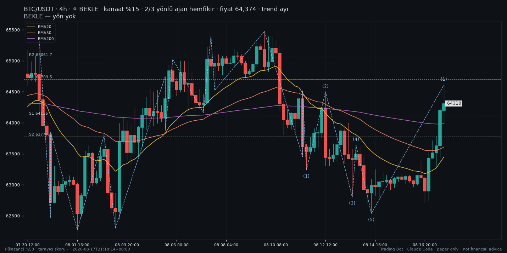

# trading2 — Paper-Trading Research Bot for Binance Futures

A research platform that runs several crypto trading strategies side by side **with simulated (paper) money only**, records every decision, and measures, after costs, what worked and what did not.


> **Important:** this bot never sends real orders and needs no exchange API keys. All results are paper-only
> (simulated), and so far they are **statistically inconclusive**. Nothing in this repository is financial advice.

> **Branches:** `main` holds an earlier v2 snapshot (multi-coin analysis, walk-forward backtests, Obsidian notes).
> Active development happens on the feature branch `claude/gifted-knuth-0ehpcs`, which this README describes.



*A chart the bot generated (4h candles, EMA20/50/200, swing labels, support/resistance). Paper only.*

## Overview

trading2 is a personal research project by a computer-engineering student. It watches Binance spot and USDⓈ-M perpetual futures markets, lets several independent strategy "books" open simulated positions, and keeps an append-only record of every trade and every signal that was *not* taken. The goal is not to promise returns but to answer an honest question with data: *"In this situation, with this setup, did we win or lose before — after fees, funding and slippage?"*

**Status:** research / work in progress. Paper mode is the default and the only mode that can place trades; the LIVE path is disabled in this version.

## Features

- **Multiple paper strategy books** running in parallel, each with its own simulated balance and ledger:
  main multi-agent bot, EMA200 trend (T2), 28-day time-series momentum (M2), intraday "box" fade, Donchian breakout (D4),
  candle-variation books (C4 / C4S) and a separate chart-pattern book for newly listed coins ("Formasyon").
- **Realistic paper accounting** — `Decimal` math, taker fees, funding at 00/08/16 UTC, slippage, tick/step/min-notional
  exchange filters, isolated margin and liquidation checks.
- **Multi-agent decision layer** — per-coin specialists (volatility, trend, candles, volume, S/R, momentum, historical
  analogs, live market data) → coin head → red team → chief → deterministic global risk engine.
- **Learning mode (paper only)** — relaxes limits that only block valid signals so every book collects more R-multiple
  experience, while keeping limits that protect measurement quality (data identity, stop geometry, double counting).
- **Counterfactual labels** — every valid signal that could not be opened is stored as a "what if" trade and labelled
  later with closed bars and the same cost model (net R, versioned labels).
- **Shared experience memory** — one record-only store of real trades and counterfactuals with a market-situation
  snapshot; a shadow advisor logs ENTER / SKIP / NEUTRAL / NOT ENOUGH DATA but never changes a decision.
- **Research signal lab** — tests candle/chart signals and crowd data (open interest, long/short ratios, taker flow,
  funding) on Binance public archives with **pre-registered, hash-sealed hypotheses**, discovery/validation splits,
  day-clustered bootstrap intervals and placebo signals. Runs in GitHub Actions.
- **Read-only web dashboard** (FastAPI + local Plotly) — books, positions, trades, learning, risk, health and charts.
- **Obsidian vault output** — canvas diagrams and Markdown notes for coins, agents, signals and lessons.
- **Operations** — health checks, kill switch, singleton lock, backups/restore, optional Telegram/Discord alerts.
- **Large test suite** — 3,000+ pytest tests; tests run offline on synthetic data.

## Tech stack

| Area | Tools |
|---|---|
| Language | Python 3.12 |
| Data & math | pandas, NumPy, PyArrow (Parquet), `Decimal` accounting |
| Market data | Binance public endpoints and `data.binance.vision` archives, ccxt, TradingView websocket (read-only) |
| Web / API | FastAPI, Uvicorn, Pydantic, Plotly |
| Charts & notes | Matplotlib, Obsidian (Markdown + canvas) |
| Quality | pytest, Hypothesis, Ruff, mypy, GitHub Actions |
| Deployment | Docker / Docker Compose, systemd units |

## Project structure

```text
tradingbot/
├── engine_v3.py, cli_v3.py      # main engine and command-line interface
├── strategy_paper.py            # strategy books (T2, M2, Box, D4, C4)
├── pattern_trader/              # "Formasyon" chart-pattern paper book
├── accounting/                  # futures/spot ledgers, fees, funding, liquidation
├── risk/                        # risk engine, profiles, modes, kill switch
├── coinhead/, agents/           # per-coin specialists, red team, chief
├── learning_mode.py, learning_cf.py   # learning mode + counterfactual recorder
├── shared_experience/           # shared experience memory + shadow advisor
├── learn/, quant/, replay/      # labels, journals, evaluation, historical replay
├── signal_lab.py, crowd_lab.py  # research labs with pre-registered hypotheses
└── dashboard/                   # read-only FastAPI dashboard
docs/                            # architecture, risk policy, learning mode, research notes
tests/                           # pytest suite
deploy/                          # Docker Compose, systemd units, env template
```

## Getting started

Requires **Python 3.12** (the code uses 3.12-only f-string syntax).

```bash
git clone https://github.com/CoskunerBerke/trading2.git
cd trading2
git checkout claude/gifted-knuth-0ehpcs      # active development branch

pip install -r requirements.txt              # dev tools: pip install -r requirements-dev.txt
python -m tradingbot doctor                  # environment / state / mode check (PAPER)
python -m tradingbot tour                    # run one full tour
python -m tradingbot watch --interval 15 --scan-every 2   # run continuously
python -m tradingbot dashboard               # read-only dashboard on http://127.0.0.1:8080
python -m pytest tests -q                    # run the test suite
```

On `main` (v2 snapshot) the entry points are `python -m tradingbot run`, `analyze`, `sweep`, `agents`, `scan`, `tour` and `watch`.

Settings live in `config.yaml` (coin universe, books, risk, learning mode, Obsidian vault path).

### Environment variables (all optional)

Names only — see `deploy/env.example` on the development branch. Never commit real values.

`ANTHROPIC_API_KEY`, `LLM_DAILY_BUDGET_USD` (optional LLM research layer; it can never open trades) ·
`BINANCE_TESTNET_API_KEY`, `BINANCE_TESTNET_API_SECRET` (testnet only) ·
`TRADINGBOT_DATA`, `TRADINGBOT_STATE_DIR`, `TRADINGBOT_CACHE_DIR`, `TRADINGBOT_VAULT_PATH`, `TRADINGBOT_LOG_DIR`, `TRADINGBOT_BACKUPS_DIR` ·
`DASHBOARD_HOST`, `DASHBOARD_PORT`, `DASHBOARD_TOKEN` · `TELEGRAM_BOT_TOKEN`, `TELEGRAM_CHAT_ID`, `DISCORD_WEBHOOK_URL` ·
`ALLOW_LIVE_TRADING` (keep `false`).

## Deployment

The repository ships a `Dockerfile` (plus `Dockerfile.v3` and `deploy/docker-compose.yml` on the development branch: worker + dashboard, non-root user, one data volume) and systemd unit files under `deploy/` for running the paper bot 24/7 on a small Linux server.

## Disclaimer

Paper trading only. Past or simulated results do not predict future results. This project is for learning and research and is not financial advice.

---

## Türkçe

**trading2**, Binance vadeli (USDⓈ-M) piyasaları için yalnızca **kâğıt para (simülasyon)** ile çalışan bir araştırma botudur. Birden fazla strateji yan yana, gerçek para olmadan pozisyon açar; her kararı ve açılmayan her sinyali kaydeder ve maliyetler düşüldükten sonra neyin işe yarayıp yaramadığını ölçer.

> **Önemli:** Bot gerçek emir göndermez ve borsa API anahtarı istemez. Sonuçlar yalnızca kâğıt işlemdir ve şu ana kadar
> **istatistiksel olarak kesin değildir**. Bu depodaki hiçbir şey yatırım tavsiyesi değildir.

> **Dallar:** `main` dalı eski v2 sürümünü içerir. Aktif geliştirme `claude/gifted-knuth-0ehpcs` özellik dalında yapılır.

**Durum:** araştırma projesi, geliştirme sürüyor. Varsayılan ve işlem açabilen tek mod PAPER'dır; LIVE bu sürümde kapalıdır.

### Özellikler

- **Birden çok kâğıt strateji defteri:** ana çoklu ajan botu, EMA200 trend (T2), 28 günlük momentum (M2), gün içi kutu (Box),
  Donchian kırılımı (D4), mum varyasyonları (C4 / C4S) ve yeni listelenen coinler için formasyon defteri.
- **Gerçekçi muhasebe:** komisyon, fonlama (00/08/16 UTC), kayma, borsa filtreleri, izole marj ve likidasyon kontrolü.
- **Çoklu ajan karar katmanı:** coin başına uzman ajanlar → coin yöneticisi → red team → baş yönetici → deterministik risk motoru.
- **Öğrenme modu (yalnız PAPER):** yalnızca geçerli sinyali engelleyen limitler gevşetilir; ölçüm kalitesini koruyan limitler kalır.
- **Karşı-olgusal ("olsaydı") etiketler:** açılamayan geçerli sinyaller kaydedilir ve kapanmış barlarla, aynı maliyet modeliyle net R olarak etiketlenir.
- **Ortak deneyim hafızası:** gerçek işlemler ve karşı-olgusallar piyasa durumu anlık görüntüsüyle tek yerde tutulur; gölge danışman
  GİR / GİRME / NÖTR / VERİ AZ tavsiyesini yalnızca kaydeder, hiçbir kararı değiştirmez.
- **Sinyal laboratuvarı:** mum/grafik sinyalleri ve kalabalık verisi (OI, long/short oranları, taker akışı, fonlama), Binance
  arşiv verisiyle, **önceden kaydedilmiş ve mühürlenmiş hipotezlerle**, keşif/doğrulama ayrımı ve plasebo sinyallerle sınanır.
- **Salt-okunur web paneli** (FastAPI + Plotly), **Obsidian** notları ve şemaları, sağlık kontrolü, kill switch, yedekleme ve
  isteğe bağlı Telegram/Discord bildirimleri.
- **3.000+ pytest testi** (ağsız, sentetik veriyle).

### Kurulum

Python 3.12 gerekir.

```bash
git clone https://github.com/CoskunerBerke/trading2.git
cd trading2
git checkout claude/gifted-knuth-0ehpcs
pip install -r requirements.txt
python -m tradingbot doctor      # ortam ve mod kontrolü
python -m tradingbot tour        # tek tur
python -m tradingbot watch --interval 15 --scan-every 2   # sürekli çalışma
python -m tradingbot dashboard   # http://127.0.0.1:8080
python -m pytest tests -q
```

Ayarlar `config.yaml` dosyasındadır. Ortam değişkenlerinin adları için geliştirme dalındaki `deploy/env.example` dosyasına bakın; gerçek değerleri asla commit etmeyin. Sunucuda 7/24 çalıştırmak için Docker ve systemd dosyaları `deploy/` klasöründedir.

### Uyarı

Yalnızca kâğıt işlemdir. Geçmiş veya simüle edilmiş sonuçlar gelecekteki sonuçları göstermez. Bu proje öğrenme ve araştırma amaçlıdır; yatırım tavsiyesi değildir.

---

Built by [Berke Coşkuner](https://github.com/CoskunerBerke)
