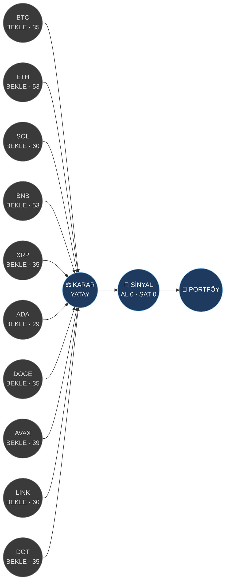

# 📊 Trading Bot — Dashboard
> Son çalışma: **2026-08-18 00:19** · Borsa: tradingview:BINANCE · TF: 4h · BTC rejimi: **YATAY**

Şema için: [[Trading Bot Şeması]] · Sinyal logu: [[Signals/Son Sinyal]] · Backtest: [[Backtests/Sweep]] · Portföy: [[Portfolio]]

## Akış (analiz → karar → sinyal)

## Coin özeti
| Coin | Spot karar | 🧠 Ajan yöneticisi | Kanaat | Skor | Fiyat | 24s % | RSI | Rejim | Strateji | WFO Sharpe | Edge |
|---|---|---|---|---|---|---|---|---|---|---|---|
| [[Coins/BTC\|BTC/USDT]] | ⚪ BEKLE | [[Agents/BTC\|⚪ BEKLE]] | 15 | 35 | 64,310 | 1.9 | 70 | YATAY | EMA Trend Takibi | -1.91 | ❌ |
| [[Coins/ETH\|ETH/USDT]] | ⚪ BEKLE | [[Agents/ETH\|⚪ BEKLE]] | 0 | 53 | 1,907 | 1.1 | 61 | YATAY | Donchian Kırılım | 0.05 | ❌ |
| [[Coins/SOL\|SOL/USDT]] | ⚪ BEKLE | [[Agents/SOL\|⚪ BEKLE]] | 10 | 60 | 75.81 | 0.8 | 53 | YÜKSELİŞ | EMA Trend Takibi | -0.06 | ❌ |
| [[Coins/BNB\|BNB/USDT]] | ⚪ BEKLE | - | - | 53 | 605.24 | -0.1 | 46 | YATAY | EMA Trend Takibi | -0.59 | ❌ |
| [[Coins/XRP\|XRP/USDT]] | ⚪ BEKLE | - | - | 35 | 1.00 | 0.0 | 46 | DÜŞÜŞ | EMA Geri Çekilme | -0.97 | ❌ |
| [[Coins/ADA\|ADA/USDT]] | ⚪ BEKLE | - | - | 29 | 0.1738 | -2.5 | 33 | DÜŞÜŞ | Donchian Kırılım | -0.71 | ❌ |
| [[Coins/DOGE\|DOGE/USDT]] | ⚪ BEKLE | - | - | 35 | 0.0703 | 0.5 | 53 | DÜŞÜŞ | EMA Trend Takibi | -1.44 | ❌ |
| [[Coins/AVAX\|AVAX/USDT]] | ⚪ BEKLE | - | - | 39 | 6.34 | -0.1 | 45 | YATAY | RSI(2) Trend İçi Geri Çekilme | -1.94 | ❌ |
| [[Coins/LINK\|LINK/USDT]] | ⚪ BEKLE | - | - | 60 | 9.50 | 0.3 | 62 | YÜKSELİŞ | RSI Ortalamaya Dönüş | 0.05 | ❌ |
| [[Coins/DOT\|DOT/USDT]] | ⚪ BEKLE | - | - | 35 | 0.7610 | -0.5 | 44 | DÜŞÜŞ | RSI Ortalamaya Dönüş | -1.70 | ❌ |

## 🏛️ Baş Yönetici
**NÖTR** — NÖTR · BTC BEKLE · 4 LONG / 3 SHORT / 8 BEKLE · geçerli plan: 7
- Piyasa modu NÖTR: yalnızca R/R ≥ 2 ve kanaat ≥ 60 olan planlar; her iki yönde de küçük boyut
- Aynı anda en fazla 3 pozisyon; toplam riske atılan sermaye ≤ %6
- Altcoinler BTC ile yüksek korelasyonlu: BTC yön değiştirirse tüm alt planlarını yeniden değerlendir
- Her plan 4h kapanışına göre tetiklenir; bar içi fitillere göre işlem açma
Detay: [[Agents/Baş Yönetici]] · Alarmlar: [[Agents/Alarmlar]]

## Portföy
- Equity: **50.00 USDT** (başlangıç 50.00)
- Nakit: 50.00 · Açık pozisyon: 0 · Kapanan işlem: 0 · Gerçekleşen P&L: 0.00

> ⚠️ Bu bot yalnızca analiz/karar/sinyal üretir ve **kağıt** portföy tutar. Gerçek emir göndermez. Geçmiş performans gelecek getiriyi garanti etmez.