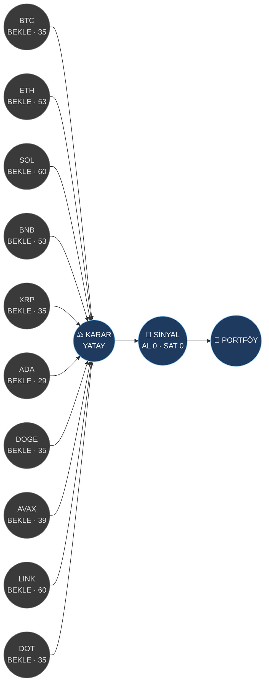

# 📊 Trading Bot — Dashboard
> Son çalışma: **2026-08-17 23:13** · Borsa: binance · TF: 4h · BTC rejimi: **YATAY**

Şema için: [[Trading Bot Şeması]] · Sinyal logu: [[Signals/Son Sinyal]] · Backtest: [[Backtests/Sweep]] · Portföy: [[Portfolio]]

## Akış (analiz → karar → sinyal)

## Coin özeti
| Coin | Karar | Güven | Skor | Fiyat | 24s % | RSI | Rejim | Strateji | OOS Sharpe | OOS PF | Edge |
|---|---|---|---|---|---|---|---|---|---|---|---|
| [[Coins/BTC\|BTC/USDT]] | ⚪ BEKLE | 35 | 35 | 64,310 | 1.9 | 70 | YATAY | RSI Ortalamaya Dönüş | -2.19 | 0.27 | ❌ |
| [[Coins/ETH\|ETH/USDT]] | ⚪ BEKLE | 53 | 53 | 1,907 | 1.1 | 61 | YATAY | Donchian Kırılım | -1.21 | 0.27 | ❌ |
| [[Coins/SOL\|SOL/USDT]] | ⚪ BEKLE | 60 | 60 | 75.81 | 0.8 | 53 | YÜKSELİŞ | EMA Trend Takibi | 0.25 | 1.19 | ❌ |
| [[Coins/BNB\|BNB/USDT]] | ⚪ BEKLE | 53 | 53 | 605.24 | -0.1 | 46 | YATAY | EMA Trend Takibi | -0.15 | 0.87 | ❌ |
| [[Coins/XRP\|XRP/USDT]] | ⚪ BEKLE | 35 | 35 | 1.00 | 0.0 | 46 | DÜŞÜŞ | Donchian Kırılım | -1.70 | 0.31 | ❌ |
| [[Coins/ADA\|ADA/USDT]] | ⚪ BEKLE | 29 | 29 | 0.1738 | -2.5 | 33 | DÜŞÜŞ | Donchian Kırılım | -1.42 | 0.43 | ❌ |
| [[Coins/DOGE\|DOGE/USDT]] | ⚪ BEKLE | 35 | 35 | 0.0703 | 0.5 | 53 | DÜŞÜŞ | Donchian Kırılım | -2.13 | 0.27 | ❌ |
| [[Coins/AVAX\|AVAX/USDT]] | ⚪ BEKLE | 39 | 39 | 6.34 | -0.1 | 45 | YATAY | RSI Ortalamaya Dönüş | -1.20 | 0.55 | ❌ |
| [[Coins/LINK\|LINK/USDT]] | ⚪ BEKLE | 60 | 60 | 9.50 | 0.3 | 62 | YÜKSELİŞ | RSI Ortalamaya Dönüş | -2.01 | 0.19 | ❌ |
| [[Coins/DOT\|DOT/USDT]] | ⚪ BEKLE | 35 | 35 | 0.7610 | -0.5 | 44 | DÜŞÜŞ | EMA Trend Takibi | -0.85 | 0.40 | ❌ |

## Portföy
- Equity: **10,000.00 USDT** (başlangıç 10,000.00)
- Nakit: 10,000.00 · Açık pozisyon: 0 · Kapanan işlem: 0 · Gerçekleşen P&L: 0.00

> ⚠️ Bu bot yalnızca analiz/karar/sinyal üretir ve **kağıt** portföy tutar. Gerçek emir göndermez. Geçmiş performans gelecek getiriyi garanti etmez.