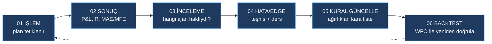

# 🧠 Öğrenme Motoru
> 2026-08-18 00:39 · durum: **VERİ TOPLUYOR** · model ısınıyor (0/20 işlem)

## Anlık görüntü
| İşlem | Kazanma % | Beklenti (R) | Kağıt equity | Getiri % | Açık | Komisyon |
|---|---|---|---|---|---|---|
| 0 | 0.0 | +0.00 | 50.00 | +0.00 | 0 | 0.00 |

## Ajan isabet oranları → öğrenilen ağırlıklar
| Ajan | İsabet % | Ağırlık (öğrenilen) | Taban |
|---|---|---|---|
| trend | - | 0.25 | 0.25 |
| momentum | - | 0.15 | 0.15 |
| candles | - | 0.12 | 0.12 |
| volume | - | 0.1 | 0.1 |
| levels | - | 0.13 | 0.13 |
| market | - | 0.12 | 0.12 |
| edge | - | 0.2 | 0.2 |

## Setup istatistikleri
| Setup × yön | n | Kazanma % | Beklenti R | Durum |
|---|---|---|---|---|

## Çıkış nedenleri

## Modelin en etkili özellikleri (lojistik regresyon ağırlıkları)
- `bias_trend`: +0.000
- `bias_momentum`: +0.000
- `bias_candles`: +0.000
- `bias_volume`: +0.000
- `bias_levels`: +0.000
- `bias_market`: +0.000
- `bias_edge`: +0.000
- `conf_trend`: +0.000
- `conf_momentum`: +0.000
- `conf_candles`: +0.000

Dersler: [[Learning/Dersler]] · İşlem günlüğü: [[Learning/Günlük]] · [[Paper Futures]] · [[Dashboard]]