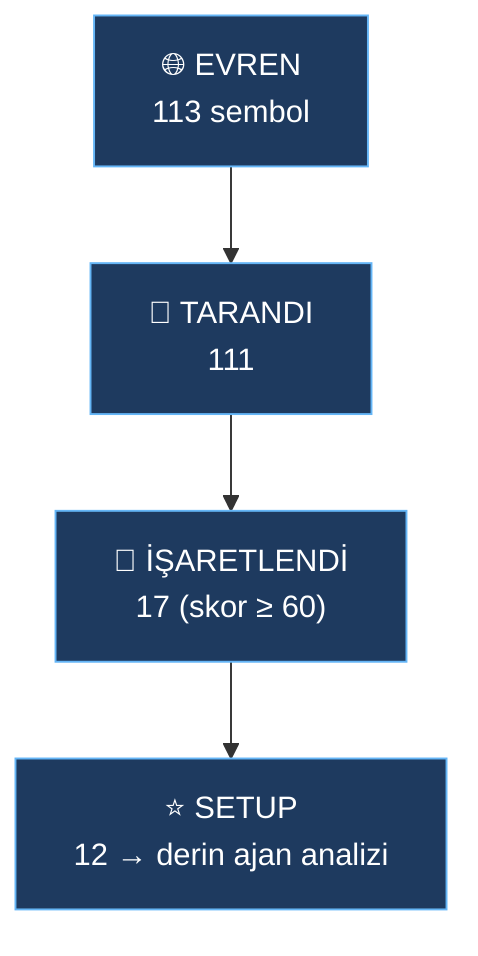

# 🔎 Piyasa Tarayıcı — tüm Binance USDT perpetual evreni
> 2026-08-18 00:19 · Evren **113** (24s hacim ≥ 20M) → tarandı **111** → işaretlendi **17** → setup **12** · 117.2s

## ⭐ En iyi setuplar (AI skoru)
| # | Sembol | Yön | Skor | Trend/25 | Momentum/25 | Hacim/25 | Tetikleyici/25 | Risk/25 | Fiyat | 24s % | Hacim 24s | Funding % | RSI 4h | ATR % | Etiketler |
|---|---|---|---|---|---|---|---|---|---|---|---|---|---|---|---|
| 1 | [[Agents/CL\|CL/USDT]] | 🟢 LONG | **81** | 13.5 | 17.1 | 25.0 | 25.0 | 25.0 | 84.03 | +3.1 | 612M | -0.0032 | 70 | 1.16 | 20-bar kırılım ↑, sıkışma→patlama |
| 2 | [[Agents/AXTI\|AXTI/USDT]] | 🟢 LONG | **81** | 25.0 | 20.6 | 25.0 | 22.5 | 17.5 | 95.89 | +18.2 | 64M | 0.0000 | 86 | 2.81 | 20-bar kırılım ↑, hacim şoku, 24s %+18 |
| 3 | [[Agents/BZ\|BZ/USDT]] | 🟢 LONG | **79** | 11.2 | 18.1 | 25.0 | 25.0 | 25.0 | 89.17 | +3.0 | 291M | -0.0042 | 72 | 1.08 | 20-bar kırılım ↑, sıkışma→patlama |
| 4 | [[Agents/META\|META/USDT]] | 🔴 SHORT | **68** | 12.5 | 17.7 | 25.0 | 22.5 | 17.5 | 569.96 | -3.8 | 27M | 0.0019 | 21 | 0.76 | 20-bar kırılım ↓, hacim şoku |
| 5 | [[Agents/LITE\|LITE/USDT]] | 🟢 LONG | **67** | 25.0 | 17.4 | 25.0 | 0.0 | 25.0 | 968.56 | +4.1 | 66M | 0.0000 | 66 | 2.07 | hacim şoku |
| 6 | [[Agents/GOOGL\|GOOGL/USDT]] | 🔴 SHORT | **67** | 19.7 | 14.6 | 23.1 | 10.0 | 25.0 | 344.32 | -1.3 | 60M | 0.0101 | 32 | 0.52 | sıkışma→patlama |
| 7 | [[Agents/XAUT\|XAUT/USDT]] | 🟢 LONG | **67** | 25.0 | 16.8 | 25.0 | 0.0 | 25.0 | 4393.46 | +0.9 | 49M | 0.0044 | 64 | 0.45 | - |
| 8 | [[Agents/PAXG\|PAXG/USDT]] | 🟢 LONG | **66** | 25.0 | 16.0 | 25.0 | 0.0 | 25.0 | 4408.24 | +0.8 | 79M | 0.0032 | 63 | 0.46 | - |
| 9 | [[Agents/POL\|POL/USDT]] | 🟢 LONG | **66** | 1.7 | 16.6 | 25.0 | 22.5 | 25.0 | 0.08 | +6.6 | 25M | 0.0050 | 78 | 1.71 | 20-bar kırılım ↑, hacim şoku |
| 10 | [[Agents/SOXS\|SOXS/USDT]] | 🔴 SHORT | **64** | 25.0 | 13.7 | 25.0 | 0.0 | 25.0 | 38.35 | -4.7 | 137M | 0.0000 | 38 | 2.31 | - |
| 11 | [[Agents/AAOI\|AAOI/USDT]] | 🟢 LONG | **64** | 25.0 | 13.5 | 25.0 | 0.0 | 25.0 | 155.11 | +0.8 | 67M | 0.0115 | 65 | 2.67 | - |
| 12 | [[Agents/FET\|FET/USDT]] | 🔴 SHORT | **63** | 25.0 | 20.5 | 17.3 | 0.0 | 25.0 | 0.1241 | +1.6 | 26M | 0.0048 | 35 | 1.98 | - |

## Tüm işaretlenenler
| Sembol | Yön | Skor | Long | Short | 24s % | Hacim | Etiketler |
|---|---|---|---|---|---|---|---|
| CL/USDT | LONG | 81 | 81 | 10 | +3.1 | 612M | 20-bar kırılım ↑, sıkışma→patlama |
| AXTI/USDT | LONG | 81 | 81 | 8 | +18.2 | 64M | 20-bar kırılım ↑, hacim şoku, 24s %+18 |
| BZ/USDT | LONG | 79 | 79 | 10 | +3.0 | 291M | 20-bar kırılım ↑, sıkışma→patlama |
| META/USDT | SHORT | 68 | 8 | 68 | -3.8 | 27M | 20-bar kırılım ↓, hacim şoku |
| LITE/USDT | LONG | 67 | 67 | 18 | +4.1 | 66M | hacim şoku |
| GOOGL/USDT | SHORT | 67 | 9 | 67 | -1.3 | 60M | sıkışma→patlama |
| XAUT/USDT | LONG | 67 | 67 | 10 | +0.9 | 49M | - |
| PAXG/USDT | LONG | 66 | 66 | 10 | +0.8 | 79M | - |
| POL/USDT | LONG | 66 | 66 | 10 | +6.6 | 25M | 20-bar kırılım ↑, hacim şoku |
| SOXS/USDT | SHORT | 64 | 10 | 64 | -4.7 | 137M | - |
| AAOI/USDT | LONG | 64 | 64 | 10 | +0.8 | 67M | - |
| FET/USDT | SHORT | 63 | 7 | 63 | +1.6 | 26M | - |
| BTC/USDT | LONG | 62 | 62 | 18 | +2.1 | 9,038M | 20-bar kırılım ↑, hacim şoku |
| APT/USDT | SHORT | 61 | 22 | 61 | +1.0 | 21M | - |
| CRWV/USDT | LONG | 60 | 60 | 32 | -0.0 | 23M | hacim şoku |
| ETHFI/USDT | LONG | 60 | 60 | 6 | -0.7 | 22M | - |
| ARM/USDT | SHORT | 60 | 10 | 60 | -2.1 | 21M | 20-bar kırılım ↓, sıkışma→patlama, hacim şoku |

Skor = Trend + Momentum + Hacim + Tetikleyici (her biri 25), volatilite/aşırılık riskiyle çarpılır. Setup'lar `Agents/` altında 8 uzman ajan + yönetici tarafından derinlemesine analiz edilir.

[[Dashboard]]