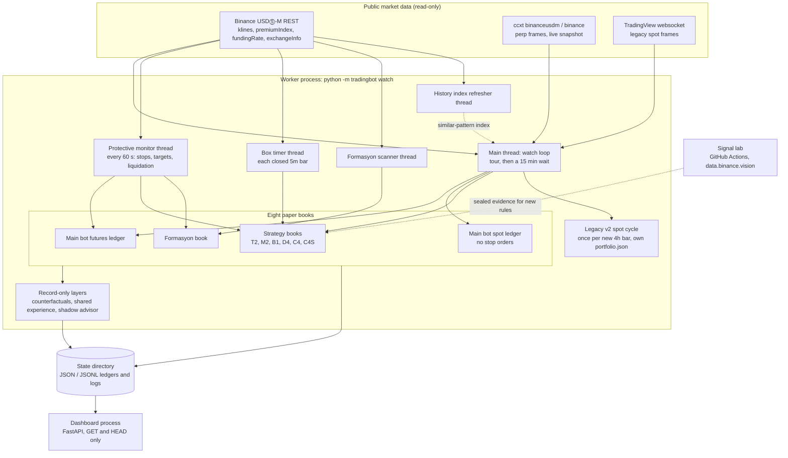
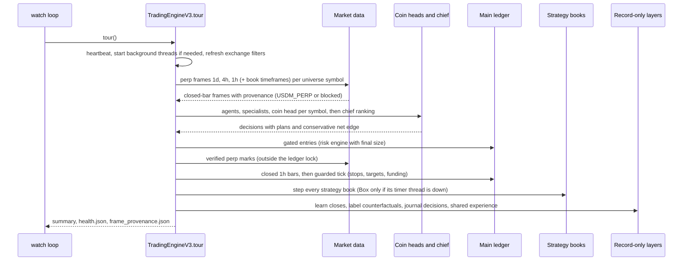
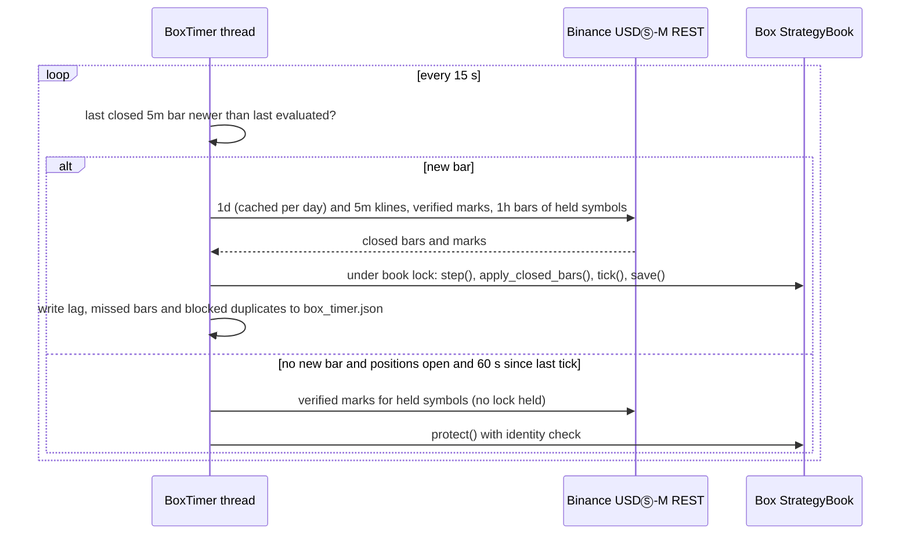
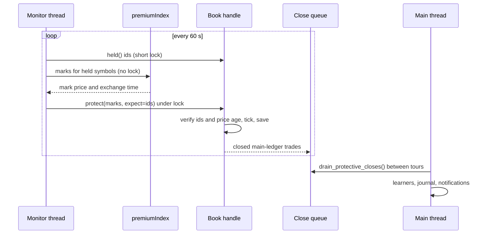
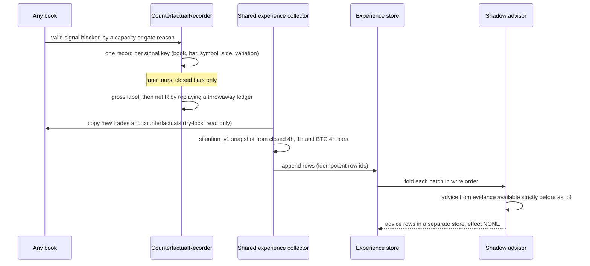
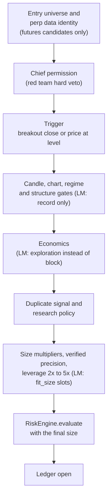
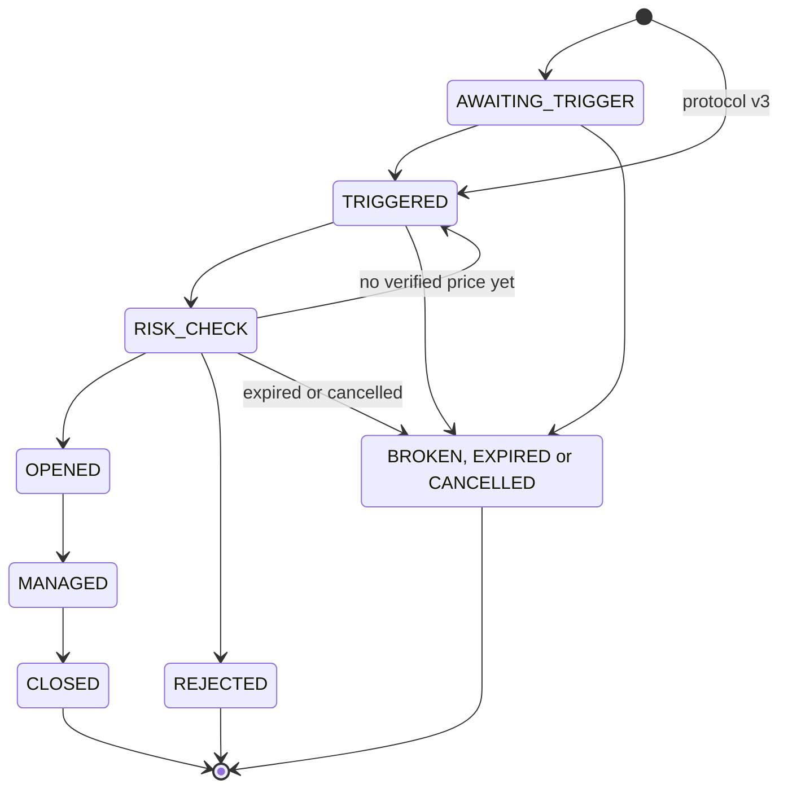

# How trading2 works

This is the English entry point to the code. It is written for an engineer who has never opened the repository and
wants to understand what was built, how it works and why it was built that way. Every statement below was checked
against the code at the commit that added this file; each mechanism links to the module and the class or function that
implements it. Code comments, log messages and most other documents in [`docs/`](README.md) are in Turkish.

> **Paper only.** The program never sends real orders and needs no exchange API keys. Results are simulated and, so
> far, statistically inconclusive. Nothing here is a claim that any strategy is profitable.

## Contents

1. [What it is and what it is not](#1-what-it-is-and-what-it-is-not)
2. [Architecture](#2-architecture)
3. [Main runtime flows](#3-main-runtime-flows)
4. [Data model](#4-data-model)
5. [Core logic in depth](#5-core-logic-in-depth)
6. [Design decisions and trade-offs](#6-design-decisions-and-trade-offs)
7. [Testing strategy](#7-testing-strategy)
8. [Limitations, known gaps and next steps](#8-limitations-known-gaps-and-next-steps)
9. [Code tour](#9-code-tour)
10. [Glossary](#10-glossary)
11. [Türkçe özet](#türkçe-özet)

## 1. What it is and what it is not

**What it is.** A long-running Python 3.12 process (the *worker*) that watches Binance USDⓈ-M perpetual futures through
public market-data endpoints and runs eight independent strategy *books* side by side. Each book has its own simulated
account and ledger:

| Book | Config name | Idea in one line |
|---|---|---|
| Main bot | (`engine_v3`) | Multi-agent decision per coin: specialists → coin head → red team → chief → global risk engine |
| T2 | `t2_trend_regime` | Daily close above EMA200 while BTC is above its own EMA200 → long |
| M2 | `m2_tsmom28` | Daily close above the close 28 days earlier while BTC is above EMA200 → long |
| B1 Box | `b1_box_fade` | Fade the previous UTC day's high/low range on 5-minute bars |
| D4 | `d4_donchian_20_10` | 4h Donchian 20/10 breakout trend, kept as an observation book |
| C4 / C4S | `c4_candle_variations`, `c4s_candle_variations_strict` | Sealed, lab-measured 4h candle variations (standard / strict verdict) |
| Formasyon | `pattern_trader` | Protocol v3: 4h "three white soldiers" with RSI14 > 70 → long |

Around the books sit three record-only layers (counterfactual "what if" labels for valid signals that could not be
opened, a shared experience store, and a *shadow advisor* that logs advice but never acts on it), a read-only web
dashboard, and an offline research *signal lab* that tests pre-registered hypotheses on archived exchange data.

**What it is not.**

- Not a live trading system. The only path that opens positions is the in-process paper ledger. Config validation
  rejects `LIVE` and `LIVE_LIMITED` modes ([`config_v3.py`](../tradingbot/config_v3.py)), and
  [`execution/gateway.py` `LiveGateway`](../tradingbot/execution/gateway.py) raises unless three locks are set and then
  raises `NotImplementedError` anyway. Testnet gateways exist and are tested against fake HTTP, but are disabled by
  default.
- Not evidence of an edge. The live paper books are a forward test; the lab results that motivated some books are
  historical and documented with their caveats in the linked documents. The point of the project is to measure honestly,
  after fees, funding and slippage.
- Not a library or a deployable product. It is one person's research platform with an opinionated, mostly Turkish
  operations layer.

**Honest status of the books** (from [`config.yaml`](../config.yaml) at this commit): D4 failed the lab's strict test and
is kept as an observation book; C4 trades eight user-approved variations marked as observations (their lab records say
"weak trace" for one and "no evidence" for seven); C4S has an empty variation list, so it is enabled but waits and opens
nothing; the shadow advisor only records. The optional LLM layer is configured as `provider: noop`.

**Which rules are running at this commit.** The committed `config.yaml` sets `mode: PAPER` and
`learning_mode.enabled: true`, with every book except C4S switched into learning mode. Learning mode
([section 5.6](#56-learning-mode-paper-only)) is therefore what governs the running system, not the baseline. It is
re-checked at the start of every tour and falls back to the baseline only if its paper-only mode gate fails. Most rules
below are described first in their baseline form, because learning mode is defined as a set of differences from that
baseline. Each difference that changes what a book can open is stated next to the rule it changes and collected per book
in [the learning-mode table](#effective-rules-per-book-under-the-committed-config). In short:

- Every book in learning mode sizes from equal slots at a 0.5% target risk.
- Learning-extra entries are split by cause (since 2026-10-03, `learning_mode.extra_entries: record_selectivity`). An
  entry that only an account or book capacity limit or an order-size rule would have stopped (total open risk, position
  counts, margin, minimum order) opens for real. An entry the baseline rules would reject *as a signal* is not opened
  and is recorded as a counterfactual with reason `LEARNING_RECORD_ONLY`
  ([`classify_unlock_codes`](../tradingbot/learning_mode.py)).
- The main bot records its edge-based size multipliers without using them. Candidates the baseline economics view
  would reject (negative edge, research size), and candidates its regime gate, candle veto or blocking structure
  decisions would stop, are evaluated as before but recorded instead of opened. T2 and M2 record (rather than open)
  entries their blocking structure decisions would stop.
- Box accepts stops down to 0.5% instead of 2.22% (0.32% until 2026-10-03); those entries open for real.
- D4 and C4 scan the whole 40-coin universe, and Formasyon its 30 lab coins plus that universe; entries outside a book's
  own lab universe are recorded only.

## 2. Architecture

One worker process owns all paper ledgers: those of the eight books, plus the small spot paper portfolio of the legacy v2
walk-forward cycle (`portfolio.json`, [3.1](#31-the-watch-loop-and-one-tour)).
Inside it, the main *tour* loop runs on the main thread and four background
threads take the work that must not wait for a slow tour. A separate dashboard process only reads the state directory.



| Component | Responsibility | Code |
|---|---|---|
| CLI and watch loop | Singleton lock, worker authority check, tours on an interval, heartbeat, cooperative stop | [`cli.py` `cmd_watch`](../tradingbot/cli.py) |
| Tour orchestration | Data, decisions, execution, ticks, learning and state files for the main bot; drives the strategy books | [`engine_v3.py` `TradingEngineV3.tour`](../tradingbot/engine_v3.py) |
| Market data | Binance REST providers, rate budget, closed-bar helpers, live snapshot | [`market/providers.py`](../tradingbot/market/providers.py), [`market/ratelimit.py`](../tradingbot/market/ratelimit.py), [`agents/market.py` `BinanceLive`](../tradingbot/agents/market.py) |
| Main bot decision | Legacy agents and new specialists, coin head, red team, chief | [`agents/`](../tradingbot/agents), [`coinhead/`](../tradingbot/coinhead) |
| Economics and risk | Conservative net edge, sizing, global risk engine, kill switch | [`opportunity.py`](../tradingbot/opportunity.py), [`risk/engine.py`](../tradingbot/risk/engine.py), [`risk/killswitch.py`](../tradingbot/risk/killswitch.py) |
| Strategy books | One shared executor for all single-rule books | [`strategy_paper.py` `StrategyBook`, `apply_action`](../tradingbot/strategy_paper.py), [`paper_rules.py`](../tradingbot/paper_rules.py) |
| Formasyon book | Plan lifecycle, background scanner | [`pattern_trader/book.py`](../tradingbot/pattern_trader/book.py), [`pattern_trader/scheduler.py`](../tradingbot/pattern_trader/scheduler.py) |
| Paper accounting | `Decimal` isolated-margin ledger, fees, slippage, funding, liquidation | [`accounting/`](../tradingbot/accounting) |
| Background protection | Book-independent stop/target/liquidation checks; Box 5m evaluation | [`protective_monitor.py`](../tradingbot/protective_monitor.py), [`box_timer.py`](../tradingbot/box_timer.py) |
| Learning mode | Paper-only relaxation of capacity limits and of some selectivity gates, with slot sizing (enabled at this commit) | [`learning_mode.py`](../tradingbot/learning_mode.py), [`learning_basis.py`](../tradingbot/learning_basis.py) |
| Counterfactuals | Recording and net-R labelling of blocked valid signals | [`learning_cf.py`](../tradingbot/learning_cf.py) |
| Shared experience | Situation snapshot, one store for all books, report, shadow advisor | [`shared_experience/`](../tradingbot/shared_experience) |
| Research labs | Pre-registered signal, OI/funding and crowd labs | [`signal_lab.py`](../tradingbot/signal_lab.py), [`futures_lab.py`](../tradingbot/futures_lab.py), [`crowd_lab.py`](../tradingbot/crowd_lab.py) |
| Dashboard | Read-only FastAPI pages, JSON API, health, metrics, SSE | [`dashboard/app.py` `create_app`](../tradingbot/dashboard/app.py) |
| Operations | Doctor, preflight, backups, locks, authority, stop, alerts | [`ops/`](../tradingbot/ops), [`deploy/`](../deploy) |

## 3. Main runtime flows

### 3.1 The watch loop and one tour

`python -m tradingbot watch --interval 15 --scan-every 2` (the systemd command) acquires an OS-level singleton lock on
`state/.lock`, refuses to start if `state/worker_authority.json` names another host, registers a cooperative-stop token,
starts the protective monitor and then loops. Each iteration may run the legacy v2 spot walk-forward cycle once per new
4h bar (it re-optimises indicator families per coin and writes `signals.json`, whose out-of-sample edge the main bot's
red team reads; it also trades its own legacy spot paper portfolio, `portfolio.json`, on the 40 config coins: BUY on a
buy signal, or one at most two bars late, with a validated out-of-sample edge and confidence ≥ `min_confidence_to_buy`
(55), SELL on a stop hit or an exit signal, and a trailing ATR stop while held; [`decision.py`](../tradingbot/decision.py),
[`cli.py` `run_cycle`](../tradingbot/cli.py)), runs one tour, and then waits in 2-second steps: a heartbeat every ~30 s, a stop-request check every
step, and, while the monitor thread is alive, learning from the closes it queued
([`cli.py` `cmd_watch`](../tradingbot/cli.py)). An exception inside a tour is logged and written to `health.json` as
`DEGRADED`; it does not end the loop.

**Cadence.** The 15-minute wait starts when a tour ends, so the main bot's decision interval is the tour's own duration
plus 15 minutes. A tour runs on the main thread and walks every universe symbol and every book. Only the coin-head step
(the newer specialists plus the head's decision) fans out, to a pool of `coin_heads.max_workers` = 4 threads
([`coinhead/registry.py` `CoinHeadRegistry.run_many`](../tradingbot/coinhead/registry.py)). Each tour writes its duration
to `health.json` (`seconds`) and, per numbered step, to `health.json` `phases` with one "tur fazları" log line
([`ops/tour_phases.py`](../tradingbot/ops/tour_phases.py)), and the Box timer's module docstring records one production measurement of 1,414 s for 41
symbols. At that length a new main-bot decision comes roughly every 39 minutes (1,414 s + 900 s). That interval is
longer than the 15-minute window in which a 5-minute candle counts as fresh, and far too long for stop checks. That is
why the Box rule and position protection run on their own threads (sections 3.2 and 3.3) instead of inside the tour.

**Keeping tours short (decision-neutral).** When the history-index refresher publishes a new similar-pattern index, the
pattern-evidence cache key (symbol, index version, last bar) changes and the next tour would recompute every kNN query
on the main thread. After each publish, and never before it, a single background worker now computes that evidence with
the published index, the tour's own function and the same inputs, and seeds the cache under that version; a tour that
asks for a symbol being computed waits for the same result ([`patterns/evidence_cache.py`](../tradingbot/patterns/evidence_cache.py)).
The chart-analysis index is written once per tour instead of once per new analysis, and the closed-trade exit
evaluation and the entry-snapshot trade links are memoised. Tests pin that ledgers and decisions are identical with these
changes on and off.

**Threads and locks.** The tour, the protective monitor (every 60 s), the Box timer (polls every 15 s) and the
Formasyon scanner (60 s cycles) all write to paper ledgers; the history-index refresher does not. The rule for every
ledger writer is the same: fetch over the network with no lock held, then take the book's lock for one short section.
The background threads also re-check, inside that section, that the positions they priced are still the same ones.

- The main futures ledger has one re-entrant lock
  ([`engine_v3.py` `TradingEngineV3._ledger_lock`](../tradingbot/engine_v3.py)). The tour (opening a position, applying
  closed 1h bars and ticking, posting late funding, tagging), the protective monitor and `exit_check` (the watch loop's
  fallback when the monitor thread is not alive) all serialise on it.
- A second lock, `_entry_lock`, makes "evaluate candidates → fill → re-read portfolio state" one serial critical section
  ([`engine_v3.py` `_execute`](../tradingbot/engine_v3.py)). Alert delivery (Telegram HTTP) is flushed after it is
  released, so a slow transport cannot hold it.
- Every strategy book and the Formasyon book has its own re-entrant `lock`
  ([`strategy_paper.py` `StrategyBook`](../tradingbot/strategy_paper.py),
  [`pattern_trader/book.py` `PatternBook`](../tradingbot/pattern_trader/book.py)). The Box timer holds the Box book's
  lock for step, closed bars, tick and save, after its klines and marks have been fetched.
- The shared experience collector only *tries* each book's lock, with a 0.2 s timeout; a busy book is skipped for that
  step and picked up next time, because the collector's cursors are incremental
  ([`shared_experience/collector.py`](../tradingbot/shared_experience/collector.py)).



The order inside [`TradingEngineV3.tour`](../tradingbot/engine_v3.py) matters and is commented in the code: the
calibrated win probability is computed *before* the economic assessment (an earlier order let the head's optimistic
prior override the model), the ledger is saved *before* learning runs (a crash cannot learn a close twice), and the
record-only layers run *after* every decision so they cannot influence one.

### 3.2 The Box timer thread

The main tour cycle is about 39 minutes (section 3.1), while the Box rule reacts to 5-minute candles whose frame counts
as fresh only within a 15-minute lag tolerance. Instead of loosening the freshness threshold, [`box_timer.py` `BoxTimer`](../tradingbot/box_timer.py) evaluates
the Box book on its own thread right after every 5m close. It polls every 15 s, waits 3 s after the bar boundary for the
exchange to publish the candle, evaluates each closed 5m bar at most once (the last evaluated bar survives restarts in
`box_timer.json`) and blocks a second entry from the same signal candle. While the timer is alive, the tour skips the
Box book ([`engine_v3.py` `_box_timer_owns`](../tradingbot/engine_v3.py)), so there is exactly one evaluation path.



### 3.3 The protective monitor

[`protective_monitor.py` `ProtectiveMonitor`](../tradingbot/protective_monitor.py) checks the open positions of the main
bot's futures ledger, every strategy book and the Formasyon book every `--exit-every` seconds (default 60). The main bot's
spot ledger is not among its handles ([`engine_v3.py` `_protective_handles`](../tradingbot/engine_v3.py); see
[section 5.2](#spot-or-futures-and-the-two-main-bot-ledgers)). The contract is written at the top of the module:

- Network calls happen with no ledger lock held. Each book is then updated in one short atomic section: lock, identity
  check, tick, save, unlock.
- Prices come from one batched `premiumIndex` request (perp mark plus the exchange's own timestamp; per-symbol mark
  price as a fallback) and must pass
  [`strategy_paper.py` `verified_price`](../tradingbot/strategy_paper.py): finite, positive, at most 180 s old, at most
  120 s in the future. A symbol without a valid price is not ticked; the gap is recorded with its reason.
- Before ticking, the position id captured before the network call is checked again under the lock (`expect`), so a
  position closed and reopened by the tour in between is never touched by a stale observation.
- The monitor thread never learns, sizes or notifies. Main-ledger closes go to a persistent queue that the main thread
  drains ([`engine_v3.py` `drain_protective_closes`](../tradingbot/engine_v3.py)).



### 3.4 From a blocked signal to a label and a piece of advice



## 4. Data model

All state is plain files under the state directory (`TRADINGBOT_STATE_DIR`, or `$TRADINGBOT_DATA/state`). JSON files are
written atomically (temporary file and rename, [`core`](../tradingbot/core)); logs and journals are append-only JSONL.

| File or folder | Contents | Written by |
|---|---|---|
| `portfolio.json`, `signals.json` | Legacy v2 spot cycle: its own paper portfolio (cash, units, stops, history) and the latest per-coin signals; not part of the eight books | [`cli.py` `run_cycle`](../tradingbot/cli.py), [`decision.py`](../tradingbot/decision.py) |
| `futures_ledger.json`, `spot_ledger.json` | Main bot's paper ledgers (wallet, open positions, closed history) | [`FuturesLedgerV2.save`](../tradingbot/accounting/futures_ledger.py), [`SpotLedger`](../tradingbot/accounting/spot_ledger.py) |
| `<state_dir>/futures_ledger.json` | One ledger per strategy book (`strategy_paper`, `strategy_paper_m2`, `strategy_paper_box`, `strategy_paper_trend4h`, `strategy_paper_candle4h`, `strategy_paper_candle4h_strict`) and `pattern_trader/` | [`StrategyBook`](../tradingbot/strategy_paper.py), [`PatternBook`](../tradingbot/pattern_trader/book.py) |
| `<state_dir>/counterfactual_trades.json` | Pending and labelled counterfactuals of that book (learning mode) | [`CounterfactualRecorder`](../tradingbot/learning_cf.py) |
| `trade_memory.jsonl`, `shadow_book.json` | Main bot's append-only trade memory and its shadow/counterfactual trades | [`learn/`](../tradingbot/learn) |
| `risk.json`, `coin_heads.json`, `health.json`, `heartbeat.json`, `frame_provenance.json` | Per-tour risk state, decisions, health, liveness and data identity per symbol | [`engine_v3.py`](../tradingbot/engine_v3.py) |
| `box_timer.json`, `protective_monitor.json` | Thread status: lag, missed bars, longest gap between verified observations | [`box_timer.py`](../tradingbot/box_timer.py), [`protective_monitor.py`](../tradingbot/protective_monitor.py) |
| `monitoring_gaps.jsonl`, `exit_watermark.json` | Outage records and the monotonic "last protective observation" time | [`strategy_paper.py` `monitoring_gap_on_resume`](../tradingbot/strategy_paper.py), [`ops/gap.py`](../tradingbot/ops/gap.py) |
| `killswitch.json`, `mode.json`, `worker_authority.json`, `.lock` | Persistent kill switch, operating mode history, split-brain guard, singleton lock | [`risk/`](../tradingbot/risk), [`ops/`](../tradingbot/ops) |
| `learning_mode.json` | First moment learning mode became active (used to split before/after in reports) | [`engine_v3.py` `_lm_publish`](../tradingbot/engine_v3.py) |
| `learning_policy_basis.json` (+ `.bak`) | The baseline-learner view that decides whether a main-bot trade counts as policy or learning-extra | [`learning_basis.py` `PolicyBasis`](../tradingbot/learning_basis.py) |
| `shared_experience/experience.jsonl`, `archive/` | The single experience store: hot file plus sealed gzip segments | [`shared_experience/store.py`](../tradingbot/shared_experience/store.py) |
| `shared_experience/advice/` | Shadow advisor rows and its derived state snapshot | [`shared_experience/advice_store.py`](../tradingbot/shared_experience/advice_store.py) |

The entities that matter most:

- **Position** ([`accounting/models.py`](../tradingbot/accounting/models.py)): `symbol`, `side`, `qty`, `entry_avg`,
  `leverage`, `isolated_margin`, `stop`, `targets`, `initial_stop`, `initial_qty`, `liquidation_price`, `mae_pct`,
  `mfe_pct`, `fills`, `features` (everything the decision knew, kept for learning) and `meta` (fees, filters, stop-move
  records, verified bar cursor and gaps). A ledger holds at most one position per symbol.
- **TradeRecord**: the closed trade with `pnl` (net of fees and funding), `gross_pnl`, `fees`, `funding`, `exit_reason`,
  `r_multiple`, the fills and a cost breakdown. `r_multiple = net PnL / (|entry_avg − initial_stop| × initial_qty)`; the
  denominator is stored as `features.risk_usdt` so late funding can recompute R with the same definition
  ([`FuturesLedgerV2._finalize`](../tradingbot/accounting/futures_ledger.py)).
- **ShadowTrade** ([`learn/shadow.py`](../tradingbot/learn/shadow.py)): a hypothetical trade (entry, stop, targets,
  horizon, reason not opened). Counterfactuals use it with `is_counterfactual`, a `signal_key`, a `label_kind` and, once
  labelled, an outcome that carries both gross and net R and a `label_version`.
- **Shared experience rows** ([`shared_experience/rows.py`](../tradingbot/shared_experience/rows.py)): kinds `xp_entry`,
  `xp_outcome` and `xp_cf` in schema `shared_experience_row_v1`. Row ids are deterministic
  (`stable_id("xp", kind, book, source id, revision)`), so the store is idempotent. Real trades join on
  `trade_key = book|trade_id|opened_at`; counterfactuals on `book|signal_key|symbol|side|variation`. Each row carries a
  `setup_key = book|setup_type|side` and a coarse `family_key = family|side`, where family is one of TREND, FADE,
  BREAKOUT, CANDLE_PATTERN or MOMENTUM.
- **situation_v1 snapshot** ([`shared_experience/situation.py`](../tradingbot/shared_experience/situation.py)): 35
  market fields computed only from closed 4h, 1h and BTC 4h bars (window of 200 bars each), three calendar fields, and
  provenance (`as_of_ms`, last bar times, `input_sha`, `status`, `missing`). Its definition is hashed into `SCHEMA_SHA`; any change requires a
  new schema id.

## 5. Core logic in depth

### 5.1 Market data and the closed-bar discipline

Every decision reads closed bars only, and every frame carries its identity.

- **Closed bars.** A bar with open time `t` is usable at decision time `as_of` only if `t + timeframe ≤ as_of`. The same
  rule appears in [`data.py` `drop_unclosed_last_bar`](../tradingbot/data.py),
  [`candle_confirmation.py` `closed_bars`](../tradingbot/candle_confirmation.py),
  [`strategy_paper.py` `frame_freshness`](../tradingbot/strategy_paper.py) and the situation snapshot.
- **Freshness, not just presence.** `frame_freshness` compares the last closed bar with the bar that *should* be the
  last one at `as_of`. The tolerance is explicit per timeframe (`BAR_LAG_TOLERANCE_MS`: 1 h for 1d, 15 min for 5m and
  4h); anything older is `FRAME_STALE_<TF>` and a book neither opens nor rule-closes on it.
- **Data identity.** The entry universe is a fixed list of 40 USDⓈ-M perpetuals (`entry_universe` in `config.yaml`).
  For those symbols the tour fetches perpetual frames (1d 400 bars, 4h 700, 1h 500 and any timeframe an enabled book
  needs, 5m 500; [`engine.py` `perp_frames`](../tradingbot/engine.py)). If any required perpetual frame is missing, the
  symbol is still analysed on spot candles (exits and the dashboard need context), but new futures entries on it are
  blocked with `DATA_INVALID / FUTURES_FRAMES_UNAVAILABLE`. A spot candle never stands in for a perpetual contract. Both
  this gate and the universe gate apply to futures entries only; the main bot's spot buys are not checked by either
  ([section 5.2](#spot-or-futures-and-the-two-main-bot-ledgers)).
- **Provenance binding.** After the agents load a symbol's frames, the tour binds the provenance to the tour id and the
  last bar time of each loaded frame ([`engine_v3.py` `_bind_provenance`](../tradingbot/engine_v3.py)).
  [`strategy_paper.py` `verify_paper_data`](../tradingbot/strategy_paper.py) then requires that the frames a book reads
  are the same frames that were bound in this tour, from the expected market, and fresh. The result is a `DataVerdict`
  (`ok`, `entry_ok`, reason); without it `apply_action` applies neither an open nor a rule close.
- **Prices for ticks** are verified perpetual marks, not spot tickers, and a closed 1h bar is applied to a position only
  if it opened after the position, only once, and only if it passes integrity and scale checks
  ([`strategy_paper.py` `apply_closed_bars_to_ledger`](../tradingbot/strategy_paper.py)). Scale is accepted if the bar's
  open is within ±20% of the previous verified close (or the entry) or its close is within ±20% of the live mark; it is
  never judged on the wick, because a deep wick is exactly what a stop check must see. A bar that cannot be applied is
  kept as a gap and retried; it does not block later bars.
- **Rate limits.** Each Binance host has a token-bucket weight budget at 70% of conservative per-minute limits, aligned
  with the `X-MBX-USED-WEIGHT-1M` header, with cool-downs on 429/418
  ([`market/ratelimit.py`](../tradingbot/market/ratelimit.py)).

### 5.2 The main bot: specialists → coin head → red team → chief → risk engine

**Specialists.** Nine legacy agents ([`agents/technical.py`](../tradingbot/agents/technical.py),
[`agents/analog.py`](../tradingbot/agents/analog.py), [`agents/market.py`](../tradingbot/agents/market.py): volatility,
trend, candles, volume, levels, momentum, historical analogs, edge, live market data) are adapted to a common report
schema and joined by nine newer specialists ([`coinhead/specialists.py`](../tradingbot/coinhead/specialists.py):
data integrity, market regime, multi-timeframe, derivatives, correlation/beta, order book liquidity, risk sizing, news
catalyst, similar historical patterns). Each report has a bias in [−1, 1], a confidence and a factor group.

**Coin head** ([`coinhead/head.py` `CoinHead.decide`](../tradingbot/coinhead/head.py)), one per coin:

1. If the data-integrity specialist vetoes, the verdict is `DATA_INVALID` and nothing else runs.
2. Reports are averaged *within* factor groups first (one group, one vote, so correlated indicators cannot vote many
   times), then combined ([`coinhead/factors.py` `consensus`](../tradingbot/coinhead/factors.py)):
   `score = Σ w_g·s_g / Σ w_g`, with `w_g = base_g × regime_mult_g × calibration_g × (0.4 + 0.6·conf_g) × (0.5 + 0.5·quality_g)`.
   Groups with `|s_g| ≥ 0.15` on the other side are *dissent*;
   `confidence = min(1, |score|/0.6) × agree / (agree + dissent)`.
3. Direction is LONG if `score ≥ 0.05`, SHORT if `score ≤ −0.05`, otherwise `NO_TRADE`. With an open position the head
   returns HOLD, EXIT or REDUCE; those verdicts are recorded as advisory, and the open position is managed by the ledger.
   The old hard thresholds (consensus 0.22, confidence 0.25, expected R 1.5) are now *soft flags* that enter the
   economic assessment as penalties rather than reject.
4. Plans for spot (long only) and futures: a level plan from the legacy brief (pullback to support or breakout of
   resistance; discarded if the entry is more than 5% from the price), else an ATR plan (stop 2.5 × ATR, targets 2 × and
   3 × the stop distance). Cost is round-trip fees plus slippage plus spread plus expected funding over the plan horizon;
   expected R is `(reward% − cost%) / risk%`. Sizing uses
   [`risk/engine.py` `size_position`](../tradingbot/risk/engine.py): `notional = equity × risk% / stop%`, capped, never
   increased to reach the exchange minimum.
5. **Red team** ([`coinhead/redteam.py`](../tradingbot/coinhead/redteam.py)) runs per market and returns two lists.
   Only *hard* codes reject (stale data, missing 4h frame, clock/API issue, conflicting sources, schema-invalid LLM
   output, costs exceeding the gross edge, untradeable liquidity, liquidation before the stop, minimum-order conflict,
   risk limit, kill switch, model drift, delisting risk). *Soft* codes (weak out-of-sample edge, low trade count,
   correlation or crowding, against the BTC regime, stop too far or too close, extreme or crowded funding, new listing,
   wide spread, thin liquidity buffer) only reduce size. A test checks that both lists match the gate registry in
   [`decision_gates.py`](../tradingbot/decision_gates.py). Any LLM "veto" can only become a registered soft penalty.
6. The valid plan with the higher expected R after costs becomes the verdict (`SPOT_LONG`, `FUTURES_LONG` or
   `FUTURES_SHORT`).

#### Spot or futures, and the two main-bot ledgers

The coin head builds a spot plan only for a LONG direction on a coin that the exchange universe lists on spot, and a
futures plan when the coin has a perpetual ([`engine_v3.py` `_availability`](../tradingbot/engine_v3.py)). Each plan is
costed with its own fees: spot pays 0.10% per side, futures 0.05% per side plus expected funding over the plan horizon.
`SPOT_LONG` wins when the spot plan's expected R is the higher of the two valid plans, or when only the spot plan is
valid ([`coinhead/head.py` `CoinHead.decide`](../tradingbot/coinhead/head.py)).

- **Two ledgers.** A futures verdict opens in `FuturesLedgerV2` (`futures_ledger.json`). A `SPOT_LONG` verdict is a market
  buy in the separate `SpotLedger` (`spot_ledger.json`). A new futures ledger starts from `futures.starting_equity_usdt`
  (100 USDT) and a new spot ledger from `risk.starting_equity_usdt` (100 USDT of cash). An existing ledger file keeps the
  starting value it was created with. The risk state combines the two ledgers: equity is futures mark-to-market plus spot
  profit and loss, and the percentage limits apply to the futures ledger's starting equity
  ([`engine_v3.py` `_portfolio_state`](../tradingbot/engine_v3.py)).
- **The universe and data-identity gates do not bind spot.** The fixed entry universe gates only USDⓈ-M entries
  ([`entry_universe.py` `entry_block_reason`](../tradingbot/entry_universe.py)), and the `FUTURES_FRAMES_UNAVAILABLE`
  block is checked only for a `USDM_PERP` candidate ([`engine_v3.py` `_execute_locked`](../tradingbot/engine_v3.py)).
  A spot buy can therefore be decided on spot candles for a symbol whose perpetual frames failed. Spot candidates are
  still limited to the symbols a tour analyses (the universe plus symbols the futures ledger or a strategy book holds)
  and by the spot allocation cap: 30% of the equity basis in the baseline and 100% in learning mode.
- **Spot holdings have no protective exit.** The engine places no stop or target order after a spot buy. The spot
  ledger's `tick` only fills resting orders, the protective monitor does not watch the spot ledger, and nothing in the
  worker sells a spot holding. The risk engine says so explicitly: a holding without a stop order counts at its full
  notional as `spot_unbounded_notional_usdt`, separate from the futures stop-risk bucket
  ([`risk/engine.py` `RiskEngine.snapshot`](../tradingbot/risk/engine.py)). See
  [section 8](#8-limitations-known-gaps-and-next-steps).

#### Win probability and the economics inputs

**`p_win`.** The coin head's own prior (`0.5 + 0.25 × confidence` when the consensus score reaches `consensus_threshold`, 0.22 in
absolute value, otherwise 0.5) is replaced before any economic decision, in
[`TradingEngineV3.tour`](../tradingbot/engine_v3.py):

- If a *champion* probability model exists, `p = w × p_cal + (1 − w) × prior` with `w = n_train / (n_train + 30)`
  (`prior_blend_n`). Here `p_cal` is the logistic model's output passed through its calibrator
  ([`learn/learner_v2.py` `LearnerV2.predict`](../tradingbot/learn/learner_v2.py)). If the model's feature schema does
  not match the decision snapshot, the model is not used and the mismatch is counted.
- Otherwise `p = 0.5 × prior + 0.5 × legacy learner`, where the legacy learner is the older logistic learner.
- The prior is a hierarchical win rate ([`learn/model.py` `HierarchicalRate.estimate`](../tradingbot/learn/model.py)).
  Starting from 0.5, each level (global, regime, `symbol|setup`, regime with `symbol|setup`) is shrunk towards its parent
  as `(Σ wins + 10 × parent mean) / (n + 10)`.
- Models are trained by [`LearnerV2.train_challenger`](../tradingbot/learn/learner_v2.py). Training needs at least
  `min_samples_train = 40` closed main-bot trades with a v3 decision snapshot, and runs again only after 10 new closes and
  6 hours. A trade counts as a win if its R is above 0.25. The L2-regularised (0.05) logistic regression weights trades
  by recency with a 60-day half-life and holds out the most recent 20%. A Platt calibrator is fitted on that holdout when
  it has at least 10 trades. The result is registered only as a CANDIDATE. Promotion to CHAMPION is a manual operator
  command, and config validation rejects automatic promotion in paper mode. Without a promoted champion, the second
  branch above applies.
- An outcome-learning adjustment is computed and logged but runs in `SHADOW` by default
  (`learning_v3.influence_mode` in [`config_v3.py`](../tradingbot/config_v3.py)), so it does not change `p_win`.

**`avg_win_r`, `avg_loss_r` and `n`** come from
[`opportunity.py` `hierarchical_expectancy`](../tradingbot/opportunity.py):

- `avg_loss_r` is fixed at 1.0 R.
- A realised expectancy `E` is the learner's hierarchical mean R for `setup|side` (prior mean 0 R, same shrinkage). It
  is converted into a win size `W = (E + (1 − p) × 1.0) / p` (at least 0.1), with `p` the hierarchical win rate of the
  `symbol|setup` leaf, clipped to 0.05–0.95.
- With little history `W` rests on very few trades, so it is blended with the plan's own expected R, which already has
  costs subtracted (1.6 R if that value is missing or zero): `avg_win_r = w × W + (1 − w) × plan R` with
  `w = n / (n + 20)`. A fresh book therefore starts from its plan geometry instead of being blocked for lack of data.
- `n`, the sample size behind the uncertainty penalty, is the larger of the two effective sample sizes (win-rate leaf
  and expectancy leaf). A missing estimate is not read as zero: it leaves `n` small and the penalty large.
- In this path the basis is always `NET_OUTCOME`. Realised R is already net of fees, funding and slippage, and the plan
  R already subtracts costs, so `cost_r` is 0.

**Economics** ([`opportunity.py` `assess`](../tradingbot/opportunity.py), called through
[`economics_gate.py` `assess_one`](../tradingbot/economics_gate.py)) turns the candidate into one number:

```text
gross_expectancy_r      = p_win × avg_win_r − (1 − p_win) × |avg_loss_r|
net_expectancy_r        = gross − cost_r          (cost_r only when the expectancy comes from gross plan geometry)
uncertainty_penalty_r   = 0.20 / sqrt(n + 1)      (n = sample size behind the estimate)
conservative_net_edge_r = net − uncertainty_penalty_r − soft_penalty_r
```

`assess` also supports a `GROSS_MINUS_COSTS` basis for gross-geometry inputs, but no production caller uses it; a test
guards against subtracting costs twice. Soft evidence includes a registered penalty per soft flag (a code missing from the registry blocks the candidate
instead, fail-closed), red-team warnings, and two measured cross-section penalties from `config.yaml`. These are 0.50 R for
a SHORT, and 0.35 R for a futures contract whose coin is not listed on Binance spot (also applied when the listing is
unknown). The total soft penalty is capped at 0.60 R
([`decision_gates.py` `GateLedger.soft_penalty_r`](../tradingbot/decision_gates.py)), so many medium weaknesses cannot
add up to an automatic veto. The size multiplier is `0.20 + 0.80 × min(1, edge / 0.35)` for a positive conservative edge,
`0.25` (research size) when only the point estimate is positive, and `0` otherwise.

- **Baseline acceptance.** A candidate is *tradeable* if there is no hard block, the conservative edge is positive and the
  size multiplier is positive. Research-size candidates are not opened but tracked as shadow trades, and negative-edge
  candidates are blocked.
- **Under learning mode** (`economics_exploration: true` in the committed config), the same assessment runs with two
  changes ([`engine_v3.py` `_assess_opportunities`, `_execute_locked`](../tradingbot/engine_v3.py)):
  - The SHORT and futures-only penalties are not subtracted. They are recorded in `learning_penalties` together with the
    amount that would have applied.
  - A research-size or negative-edge candidate is not stopped. It continues as an *exploration* trade tagged
    `RESEARCH_SIZE` or `NEG_EDGE`.

  Hard economics codes (`ZERO_STOP_DISTANCE`, `UNKNOWN_GATE_CODE`) still block. The conservative edge then only orders the
  candidates; it no longer decides acceptance.

**Chief** ([`coinhead/chief.py` `ChiefPortfolioManager.decide`](../tradingbot/coinhead/chief.py)) only ranks, explains
and computes bounded soft penalties: 0.08 R when three or more open positions share the direction, 0.08 R when two or
more share the cluster and direction, and 0.10 R for trading against a RISK-ON/RISK-OFF market mode with confidence
below 0.6. These penalties only shrink the chief's size multiplier. The chief no longer reserves risk: an earlier version
consumed capacity for the top-ranked candidate even if that candidate later failed its trigger, which blocked the next
valid candidate. Its capacity projection is advisory. For an actionable candidate its only hard block is a red-team
hard veto.

**Execution order** ([`engine_v3.py` `_execute_locked`](../tradingbot/engine_v3.py)) for candidates sorted by
conservative net edge. The steps marked "LM" behave differently under learning mode:



- **Trigger** ([`entry_trigger.py` `trigger_fired`](../tradingbot/entry_trigger.py)): a breakout needs the last closed 4h
  bar to close beyond the level and the price to be within 1.5% of it (no chasing), once per bar. Pullback and market
  plans need the price within 0.25% of the planned entry.
- **Gates** are configured in `entry_selectivity`. The candle gate is `ENFORCE` with variant `c3_4h_veto`: a pattern
  against the candidate's direction on the last closed 4h bar blocks it. The chart-pattern gate is `SHADOW` (recorded
  only). The regime gate is `ENFORCE` with `r1_long_only_uptrend`, so in the baseline the main bot opens LONG only, and
  only while BTC's daily close is above its EMA200 ([`regime_gate.py`](../tradingbot/regime_gate.py)). The shared
  structures policy ([`structures/bots.py` `main_entry_decision`](../tradingbot/structures/bots.py)) can make an entry
  wait or cancel a plan, never flip its direction (details below).
- **Gates under learning mode.** `candle_veto_shadow` and `regime_gate_shadow` turn both ENFORCE gates into SHADOW
  ([`engine_v3.py` `_lm_gate_mode`](../tradingbot/engine_v3.py)). Each verdict is still computed and stored on the trade
  with a `would_block` flag, but it no longer blocks. Because `entry_universe.allow_short` is `true`, the main bot can then
  open SHORTs, and LONGs while BTC is below its EMA200. `structures_entry_shadow` lists `main`, so a blocking structure
  decision (wait, wait for trigger, cancel) is only recorded. The exceptions are a perpetual/spot frame mismatch and a
  structure-analysis error, which still block. Stop tightening on open positions stays ENFORCE.
- **Leverage** ([`risk/leverage.py` `select_leverage`](../tradingbot/risk/leverage.py)) chooses 2x to 5x from cumulative
  conditions; a candidate that fails the 2x base conditions is `LEVERAGE_GATE_BLOCKED`. Leverage only sets the initial
  margin (`notional / leverage`); the loss at the stop is set by notional and stop distance. Under learning mode
  (`leverage_confidence_fallback: true`), a candidate that fails the base only on stop distance (a tight stop must still be
  at least 0.1 ATR), book depth or confidence opens at 2x instead
  ([`learning_mode.py` `leverage_fallback`](../tradingbot/learning_mode.py)).
- **Size in the baseline.** `final_notional = plan notional × opportunity multiplier × chief multiplier × research
  multiplier`, where the chief multiplier is `max(0.25, 1 − min(0.5, 2 × penalty_r))`. A zero multiplier never opens.
- **Size under learning mode.** The multipliers are still computed and stored in `size_multipliers_recorded`, but the
  notional and leverage come from [`fit_size`](../tradingbot/learning_mode.py) (section 5.6). It uses the main book's 20
  slots, a 0.5% target risk on the equity basis, and a leverage cap equal to the lowest of the selector's level, 5, the
  profile cap and the exchange maximum, before its own liquidation-buffer limit. A zero total multiplier no longer blocks, unless the research policy's own
  multiplier is zero.
- **Risk engine** ([`risk/engine.py` `RiskEngine.evaluate`](../tradingbot/risk/engine.py)) sees the *final* size and the
  price the ledger would actually fill at (same fill function, slippage and tick rounding). The `PAPER_RESEARCH` profile
  ([`risk/profiles.py`](../tradingbot/risk/profiles.py)) applies its percentages to starting equity rather than live
  equity. Its limits:
  - risk per trade 2% (size adjusted down only);
  - total open stop-risk 6%, measured in the candidate's own market bucket;
  - leverage cap 5, and a single-position cap of 30% of equity × leverage;
  - spot allocation cap 30%;
  - one position per symbol and market, no spot short, and no spot-long / futures-short conflict on the same coin;
  - a minimum-order check that never enlarges risk.

  Position-count limits are `None` in this profile, so real capacity, not a count, stops entries. Under learning mode
  the engine evaluates against a *copy* of this profile with total open risk and spot allocation raised to 100%. The
  2% per-trade cap and the kill switch object stay the same. Capacity is consumed only by positions that actually
  opened. After each fill the state is re-read from the ledgers, and if `risk.json` cannot be written no further entries
  are taken that tour.

#### The shared structures policy (`structures_v1.7`)

All structure-aware books read one catalog of candle, chart and scenario records
([`structures/policy.py`](../tradingbot/structures/policy.py)). In ENFORCE the policy changes timing, waiting, plan
cancellation and position management; in SHADOW it only records. At this commit it is ENFORCE for main, T2, M2 and
Formasyon, SHADOW for Box, and OFF for D4, C4 and C4S. For a new entry,
[`entry_decision`](../tradingbot/structures/policy.py) applies the first matching rule:

1. No usable analysis on the decision timeframe: no effect. A main-bot pullback plan, which requires a confirmed
   structure, waits instead.
2. A confirmed *opposing* structure on the decision or context timeframe: WAIT.
3. A compatible structure that broke recently (within the catalog's `fresh_bars = 2` window): WAIT.
4. A confirmed compatible structure not yet used by this book: ENTER, unless the price has moved more than 1 ATR from
   its trigger, which is CANCEL (chase limit).
5. A compatible structure still forming: WAIT_TRIGGER.
6. Nothing relevant: no effect, except a main-bot pullback plan, which waits.

For open positions, [`hold_decision`](../tradingbot/structures/policy.py) acts only on structures confirmed *after* the
entry:

- The main bot tightens its stop to the confirmation bar's low (LONG) or high (SHORT), and only if that tightens it.
- M2 exits on a confirmed opposing structure (a bearish reversal pattern, a descending triangle or a sweep-and-reclaim),
  or when the structure its entry relied on breaks.
- T2 ignores structures after entry; only its own EMA200 exit closes it.
- Box would exit on a confirmed breakout outside the box, but runs in SHADOW.

Each structure gives at most one entry per book, tracked through `used_patterns_of` on the ledger.

### 5.3 The single-rule strategy books

All six books share one executor ([`strategy_paper.py` `StrategyBook.step` and `apply_action`](../tradingbot/strategy_paper.py))
and the replay engine calls the same functions, so the live and historical paths cannot drift apart. The rule modules
are pure functions over closed bars; [`paper_rules.py`](../tradingbot/paper_rules.py) records which timeframes each rule
reads and whether it needs BTC. Each book starts with 200 USDT of paper equity, keeps managing positions outside its
entry list, and allows one position per symbol. T2, M2 and Box enter only in the fixed 40-coin universe. In the baseline,
D4, C4 and C4S use their own 23-coin list instead (the lab's 30 coins minus the 7 that are not in the entry universe).
Under the committed learning-mode config, D4 and C4 enter on the 23 coins plus the 40-coin universe, which is the whole
40-coin universe, and tag every trade with `in_lab_universe`. C4S is excluded from learning mode and keeps its 23 coins
([`engine_v3.py` `_strategy_paper_tour`](../tradingbot/engine_v3.py)).

| Book | Bars | Entry | Initial stop | Exit | Leverage |
|---|---|---|---|---|---|
| T2 ([`ema200_trend.py` `decide`](../tradingbot/ema200_trend.py)) | 1d, BTC 1d | Last closed daily close > EMA200 and BTC regime UP (BTC daily close > its EMA200) → LONG at the verified perp price | close − 3 × ATR14(1d) | Daily close ≤ EMA200, or the stop | 2, raised only as far as needed (max 4) to fit the single-position cap |
| M2 (same module, `m2_tsmom28`) | 1d, BTC 1d | Close > close 28 days earlier and BTC regime UP → LONG | close − 3 × ATR14(1d) | Close ≤ close 28 days earlier, or the stop | 2 → 4 as needed |
| B1 Box ([`box_theory.py` `decide`](../tradingbot/box_theory.py)) | 1d, 5m | Box = previous UTC day's high/low. If any of the last two closed 5m candles touched the top 10% band and none touched the bottom band → SHORT on a red candle closing below the previous candle's low; the mirror case → LONG on a green candle closing above the previous high; a window that touched both bands is treated as the middle (no trade) | SHORT: previous candle's high; LONG: the day's low so far | Target at box mid (`exit_kind: box_mid`), stop, or flat at the end of the signal's UTC day | 3 → 4 as needed; stops narrower than 2.22% are skipped (0.5% under learning mode) |
| D4 ([`donchian_trend.py` `decide`](../tradingbot/donchian_trend.py)) | 4h | Close breaks above the previous 20-bar high for the first time → LONG, only within 60 min of the signal close and if the stop distance is 0.1–10 ATR | close − 2 × ATR14(4h) | 4h close below the previous 10-bar low, 300-bar time limit, or the stop | 1; oversized trades are shrunk to the cap, not rejected |
| C4 / C4S ([`candle_book.py` `decide`](../tradingbot/candle_book.py)) | 4h, last 500 bars with volume | First enabled variation (config order) whose detector matches on the last closed bar and whose gate passes; 60 min entry window | From the variation's detector | Target `target_r × risk` measured from the actual entry, the stop, or `max_hold_bars` | 1 |

Details that are easy to miss:

- **Exit is measured independently of entry.** For T2 and M2 the rule exit needs only the close and the threshold; if
  it cannot be measured the book records `EXIT_UNMEASURABLE` instead of silently holding
  ([`ema200_trend.py` `exit_measure`](../tradingbot/ema200_trend.py)).
- **"Leverage as needed."** Leverage does not change risk per trade (risk is `equity × risk% / stop distance`); it only
  lets a narrow-stop trade fit the `equity × 30% × leverage` cap. The executor raises leverage from the base only up to
  `ceil(notional / (equity × 30%))`, capped by `leverage_max` ([`strategy_paper.py` `_baseline_size`](../tradingbot/strategy_paper.py)).
- **Box day boundaries.** A Box trade belongs to the UTC day of its signal candle, not of its fill; the box must be
  exactly the previous day's bar (a delayed daily feed cannot silently use a two-day-old box), and a decision taken
  after midnight cannot open with yesterday's box. Box structures run in `SHADOW` because the rule was lab-tested
  without that layer.
- **C4 gate** ([`candle_variations.py` `gate`](../tradingbot/candle_variations.py)): a variation trades only if its
  definition hash (`definition_sha`) matches a lab record produced by a CI run on 4h data, the translation was approved
  *before* the lab result, the verdict is not "loses", the user approved *that* run, and, for a non-strong verdict, the
  approval explicitly says "observation". C4S additionally requires both the standard and the strict verdict to be
  "strong candidate". The gate never raises; a refused variation is logged once and shown in the book's state.
- **The eight C4 variations** ([`candle_variations.py`](../tradingbot/candle_variations.py), listed in this priority
  order in `config.yaml`) are four ideas, each with a LONG and a mirrored SHORT id. They are written in a small candle
  language ([`candle_dsl.py`](../tradingbot/candle_dsl.py)) and evaluated on the last 500 closed 4h bars. Below,
  "20-bar high/low" means the extreme of the 20 bars before the pattern, "average volume" is the mean of the 20 bars
  before that candle, ATR is ATR14 and "with trend" means close > EMA50 > EMA200 for a LONG (close < EMA50 < EMA200 for a SHORT):

  | Ids (LONG / SHORT) | Pattern, LONG side (SHORT is the mirror) | Context |
  |---|---|---|
  | `CV001` / `CV002` breakout20 trend volume | One green candle with a body of at least 55% of its range and volume at least 1.3 × average closes above the 20-bar high, and the previous bar's close had not already broken its own 20-bar high (first break) | With trend |
  | `CV003` / `CV004` pullback engulfing | A red candle, then a green candle whose body engulfs the red body, with volume at least 1.0 × average | With trend; RSI14 40–55 (SHORT: 45–60) |
  | `CV005` / `CV006` support / resistance harami | A long red candle (body at least 60% of range) whose low is within 0.5 ATR of the 20-bar low, then a green candle whose body sits inside it, closes above that low and has more volume than the red one | RSI14 at most 40 (SHORT: at least 60) |
  | `CV007` / `CV008` sweep-reject engulfing | A candle with a lower wick of at least 45% of its range trades below the 20-bar low and closes back above it, then a green candle with volume at least 1.5 × average engulfs its body | None |

  All eight share the default exits: entry is confirmed by the close of the pattern's last bar, the stop is the
  pattern's low minus 0.25 ATR (high plus 0.25 ATR for a SHORT), the target is 2 R from the actual entry, the time limit
  is 24 bars (four days), and a stop distance outside 0.1–5 ATR is refused. When several variations match on the same
  bar, the first in config order opens and the others are recorded in `also_matched`
  ([`candle_book.py` `decide`](../tradingbot/candle_book.py)).
- **Lab parity.** D4 computes its indicators with the lab's own functions ([`signal_lab.py`](../tradingbot/signal_lab.py)),
  and C4 calls the same detector as the lab ([`candle_dsl.py` `detect_last`](../tradingbot/candle_dsl.py)).
- **Structures.** T2 and M2 run the shared structures policy in ENFORCE, so an entry can wait or be cancelled and M2
  can exit on structure (section 5.2). Under learning mode their blocking entry decisions only record; the BTC-above-EMA200
  condition is part of the T2 and M2 rules themselves and still applies.
- **Under learning mode** every one of these books except C4S sizes with [`fit_size`](../tradingbot/learning_mode.py) at a 0.5% target
  risk instead of the baseline sizing above. The slot counts and leverage caps are T2 40 and 4x, M2 40 and 4x, Box 40
  and 4x, D4 20 and 3x, C4 20 and 3x. The risk engine is a copy of the profile with total open risk at 100%, the 2%
  per-trade cap kept. Box uses its learning `min_stop_pct` of 0.5% ([`StrategyBook._learning_params`](../tradingbot/strategy_paper.py)).
  Apart from that minimum stop and the structure and universe changes above, the entry rules, data checks, entry
  windows and exits are unchanged.
- An optional entry-drift gate exists in `apply_action` but is off (`max_entry_drift_pct: 0.0`) because its threshold
  has not been measured.

### 5.4 The Formasyon pattern book

The Formasyon book ([`pattern_trader/`](../tradingbot/pattern_trader)) has its own 100 USDT ledger, a background
scanner and a persistent plan lifecycle.

**Its universe is not the main entry universe.** The scanner discovers every `TRADING` USDT perpetual from the official
`exchangeInfo` ([`universe.py`](../tradingbot/pattern_trader/universe.py)). A symbol is eligible with at least 5,000,000
USDT of 24h volume and a spread of at most 0.15% (unknown spread is re-measured at entry), and there is no listing-age
filter. Protocol v3 then restricts new plans to the 30 coins the signal lab tested
([`strategy_v3.py` `V3_SYMBOLS`](../tradingbot/pattern_trader/strategy_v3.py), equal to `signal_lab.WIDE_SYMBOLS`), 7 of
which are not in the 40-coin entry universe. Under learning mode the allowed set is those 30 coins plus the 40-coin
universe, 47 symbols in all ([`PatternBook.entry_symbols`](../tradingbot/pattern_trader/book.py)). Each scan cycle
(60 s, at most 40 symbols) works through a queue built in this order
([`scheduler.py` `PatternScanner`](../tradingbot/pattern_trader/scheduler.py)):

1. symbols with open positions, every cycle;
2. symbols with pending plans;
3. recent listings (perpetual younger than 30 days);
4. the remaining eligible allowed symbols, oldest scan first.

About half of the budget left after open positions is reserved for the last two groups, so pending plans cannot starve
the rotation. Plans move through this lifecycle:



A plan that has not opened can end as BROKEN (close beyond its invalidation), EXPIRED (validity window passed) or
CANCELLED (for example a sibling plan filled, the chase limit was exceeded or the protocol changed); a failed risk or
ledger check ends it as REJECTED. Terminal plans never come back after a restart.

It runs protocol v3 ([`pattern_trader/strategy_v3.py` `build_plans_v3`](../tradingbot/pattern_trader/strategy_v3.py)),
which creates plans already triggered and tries the entry in the same scan. The signal is a confirmed
`THREE_WHITE_SOLDIERS` long record from the shared structure catalog on the last closed 4h bar with RSI14 (the lab's own
Wilder RSI) above 70. Entry is the first verified perp price after the confirmation close, within 60 min, not more than
1 ATR from the trigger and with a risk of 0.1–5 ATR. The stop comes from the catalog record; the target is
2 R from the actual entry; the time stop is 24 × 4h. Only LONG, because the short counterpart failed the strict test.
The book shares `RiskEngine` and `apply_action` with the strategy books, keeps a 3-position cap in the baseline and a
cool-down after a loss, and has no probability model (`p_win` is `None` rather than an invented 0.5). Under learning mode
the book removes three baseline limits: the position-count cap, the cool-down after a loss and the minimum R/R after
costs. It also sizes with `fit_size` (30 slots, at most 3x), waits within the entry window when liquidity is still
unknown, and records unopened valid signals as counterfactuals (see the module docstring of
[`pattern_trader/book.py`](../tradingbot/pattern_trader/book.py)).

### 5.5 Paper accounting

[`accounting/futures_ledger.py` `FuturesLedgerV2`](../tradingbot/accounting/futures_ledger.py) is an isolated-margin,
one-way USDⓈ-M ledger in `Decimal`:

- **Wallet:** `wallet_balance` (realised), `used_margin` (sum of isolated margins), `available = wallet − used`. An open
  needs `margin + entry fee ≤ available`; the ledger rejects rather than silently shrinking (learning mode can allow a
  per-call shrink, which is then tagged).
- **Fills:** market fills are moved against the trader by a fixed 3 bps ([`accounting/slippage.py`](../tradingbot/accounting/slippage.py))
  and quantised to the symbol's tick; quantity is floored to the step; minimum quantity, maximum quantity and minimum
  notional are enforced. Fees are 0.05% taker / 0.02% maker for futures and 0.10% for spot (`fees` in `config.yaml`),
  charged on fill notional.
- **Exchange filters** come from official `exchangeInfo` and are refreshed when older than 24 h. In the main bot,
  `require_verified_precision: true` means a symbol whose tick/step fell back to defaults cannot open
  (`UNRESOLVED_PRECISION`); a default 0.01 tick was measured to distort low-priced symbols' R geometry. The Formasyon book
  has its own stale/unverified filter checks. Exits are never blocked by these checks.
- **Liquidation** ([`accounting/liquidation.py`](../tradingbot/accounting/liquidation.py)) uses Binance-style leverage
  brackets: `liq_long = (entry·qty − margin + maint_amount − cushion) / (qty·(1 − mmr))` (mirrored for short). A
  liquidation charges a 0.5% fee and the loss is capped at the isolated margin.
- **Exit fill contract** ([`exit_decision`](../tradingbot/accounting/futures_ledger.py), `EXIT_FILL_CONTRACT`): the first
  observation (bar open, or the price itself for a price-only tick), then the worst extreme, then the close. A first
  observation beyond the liquidation price is a liquidation; beyond only the stop, a gap fill at that price. If the
  worst extreme crosses both levels and their order inside the bar was not observed, the ledger records the prudent
  outcome (liquidation) and keeps the alternative in the record. A stop is never filled beyond the liquidation price; if
  slippage would push it there, it is a liquidation. Stop and target in the same tick count as a stop.
- **Targets and break-even:** the first target closes 50% (`tp1_fraction`) and moves the stop to the true break-even
  price (entry fee share + exit fee + slippage buffer); the last target closes the rest. The main ledger also moves the
  stop to break-even once the best excursion reaches 1 R (`breakeven_at_mfe_r: 1.0`), once per position and only if it
  tightens the stop.
- **Funding** ([`accounting/funding.py`](../tradingbot/accounting/funding.py), `funding_settlement_v2`): each missed
  settlement is applied separately as `qty(t) × mark(t) × rate(t)` (positive rate: long pays), where `qty(t)` is the
  quantity actually open at the settlement from the fill history, `mark(t)` is the settlement row's own mark, and the
  rate is the realised rate. Settlement hours default to 00/08/16 UTC and are overridden per symbol from `fundingInfo`.
  An unknown rate or mark makes the period wait instead of being guessed; a watermark prevents double posting, and
  late settlements after a close are reconciled by `settle_late_funding` with the same formula.
- **Stop-move accounting fix** ([`strategy_paper.py` `_stops_in_bar`, `_PreMoveView`](../tradingbot/strategy_paper.py)):
  closed 1h bars are applied after the fact, so a bar that *opened before* the stop was moved (MFE break-even, TP1,
  structure tightening) must not be tested against the *new* stop. The code reconstructs the loosest and tightest stop in
  force during that bar from the position's own records. A clear exit or a bar that cannot have hit any stop is applied
  with the stop in force at the bar's open (`BAR_PRE_MOVE_STOP`); if the adverse extreme lies between the two stops,
  the intrabar order is unknowable and the bar is consumed and recorded as skipped (`OPENED_BEFORE_STOP_MOVE`).

### 5.6 Learning mode (paper only)

[`learning_mode.py`](../tradingbot/learning_mode.py) answers one question: how can every book take as many valid trades
as possible, so the shared layer collects R-multiple experience, without corrupting measurement? **It is enabled in the
committed `config.yaml`** (`learning_mode.enabled: true`), so it governs the running books unless its mode gate
suspends it.

Its stated rule is to remove a limit only when the limit merely stops a valid signal from becoming a trade. Every limit
that protects measurement stays: data identity, R geometry, double counting, impossible fills, entry windows, one
position per symbol and exchange filters. In practice it relaxes two kinds of limits:

- **capacity:** the total open-risk cap, position counts and margin bottlenecks;
- **selectivity:** the five `strategy_overrides`, which change *which* trades the main bot, T2 and M2 take.

How a trade's R is measured does not change.

- **Paper only.** Config validation refuses `learning_mode.enabled: true` unless mode is PAPER, the gateway is `paper`,
  testnet is off and the profile is `PAPER_RESEARCH`. At runtime `LearningMode.active()` re-checks the mode gate once
  per tour (the Box timer and the Formasyon scanner re-check it on their own cycles). If the gate fails, the state
  becomes `LEARNING_MODE_SUSPENDED:<reason>` and every book falls back to baseline. The environment variable can only
  switch it off.
- **Sizing with denominator K** ([`fit_size`](../tradingbot/learning_mode.py)): each book has `K` slots
  (`learning_mode.books.*.slots`). With equity basis `E`, stop fraction `s`, target risk `r = 0.5%`, reserve 5% and
  `mmr = 0.004`:

  ```text
  m_slot   = (1 − 0.05) × E / K                     margin per slot
  L_liq    = largest L with 1/L − mmr ≥ 2 × s       liquidation at least twice as far as the stop
  n_risk   = r × E / s                              notional that risks r at the stop
  L        = min(L_max, L_liq, ceil(n_risk / m_slot))
  notional = min(n_risk, m_slot × L)
  ```

  Notional is never rejected for size; it shrinks to what fits. Below the exchange minimum it may be raised to the
  minimum only if the risk at the stop stays within 2% of equity and margin is free; otherwise `MIN_ORDER_CONFLICT`.
- **Safety contract.** Total margin stays below 95% of equity (the 5% reserve is never used), the liquidation distance
  is at least twice the stop distance, risk per trade stays under the 2% profile cap, the kill switch is the same object
  as in the baseline, and the learning risk profile is a *copy* (`profile_for`) with total open risk raised to 100% (and,
  for the main bot, spot allocation raised to 100%).
- **Policy reserve.** A trade the baseline rules would also have taken is a *policy* trade. A trade opened only because
  learning mode relaxed something is *learning-extra*, and its `learning_unlocked_by` tag lists the baseline gates that
  would have stopped it. Learning-extra entries see free margin reduced by a reserve of two slots (capped at 10% of
  equity), so exploration cannot crowd out a policy trade
  ([`policy_reserve_usdt`, `fit_with_reserve`](../tradingbot/learning_mode.py)).
- **Extras by cause (2026-10-03, owner decision).** The owner wants every book to aim for at least +1% net per month on
  its own paper balance. During the learning period, closed learning-extra trades unlocked by *selectivity* were about
  zero or negative everywhere (main bot `NEGATIVE_NET_EDGE` 86 trades −0.04R, `STRUCTURE:OPPOSING_CONFIRMED` 76 −0.06R,
  `CANDLE_VETO` 30 −0.09R; M2 `STRUCTURE_OPPOSING_CONFIRMED` 22 +0.006R; `BOOK_UNIVERSE` C4 −0.32R, D4 −0.91R), while
  *capacity*-unlocked M2 `TOTAL_OPEN_RISK` trades made +0.15R over 10 trades and Box stops of 0.5–1% made +0.17R over 176
  trades against −0.56R over 72 for stops below 0.5%. These are paper measurements, not a profitability claim.
  [`classify_unlock_codes`](../tradingbot/learning_mode.py) therefore puts every `learning_unlocked_by` code in one of
  three classes:
  - **capacity** (`UNLOCK_CAPACITY`): the signal passes the baseline rules and only an account/book capacity or
    order-size gate would block it: `TOTAL_OPEN_RISK`, `MAX_POSITIONS`, `MAX_POSITIONS_MARKET`, `MAX_POSITION_PCT`,
    `MARGIN_UTILIZATION`, `SPOT_ALLOCATION`, `CLUSTER_CAP`, `ALTCOIN_EXPOSURE`, `INSUFFICIENT_MARGIN` (including the
    policy-reserve case), `MIN_ORDER_CONFLICT`, `NO_TRADE_MIN_ORDER_CONFLICT`, `MIN_NOTIONAL`, `MIN_QTY`, `STEP_ZERO_QTY`,
    `MAX_QTY`, `LEVERAGE_TOO_HIGH`, Formasyon's `RISK_ABOVE_CAP_AFTER_ROUNDING`, the never-failing `RISK_PER_TRADE` and
    `LEVERAGE_CAP`, and the occupancy codes `ALREADY_OPEN`, `ALREADY_OPEN_SAME_SYMBOL`, `OPPOSITE_EXPOSURE_CONFLICT`;
  - **Box exception** (`UNLOCK_BOX_EXCEPTION`): `BOX_MIN_STOP_PCT`, a Box stop below the baseline 2.22% but at or above
    the learning floor of 0.5%, behaves like capacity;
  - **selectivity** (everything else): the baseline would reject the signal itself: `NEGATIVE_NET_EDGE`,
    `RESEARCH_SIZE_ONLY`, `SIZE_MULTIPLIER_ZERO`, `CANDLE_VETO:*`, `REGIME_VETO:*`, `STRUCTURE:*` / `STRUCTURE_*`,
    `LEVERAGE_GATE_BLOCKED:*` (no tradeable leverage), `BOOK_UNIVERSE`, `NOT_IN_PROTOCOL_UNIVERSE`, Formasyon's
    `RR_BELOW_MIN_*`, `COOLDOWN_AFTER_LOSS`, `THIN_DEPTH`, `LIQUIDITY_UNKNOWN`, `DEPTH_UNKNOWN`, the RiskEngine stops
    (`KILL_SWITCH_ACTIVE`, loss limits, cool-downs, spread, minimum expected R, liquidation buffer, missing stop, spot
    SHORT), `BAD_PRICE`, `RISK_DENIED`, `BASELINE_UNKNOWN`, and any code not in the table.

  With `learning_mode.extra_entries: record_selectivity` (committed config; code default `open`), an entry whose codes
  include any selectivity code is not opened. The check sits where the decision to open is final — after sizing, the
  policy reserve, the learning RiskEngine and every other gate — so entries that still open are sized exactly as before.
  The candidate goes to the book's existing counterfactual recorder with reason `LEARNING_RECORD_ONLY`, the diverted
  codes after it in `reason_not_opened`, and `features.learning_record_only` (codes, class, and the notional, leverage,
  risk and size rule it would have used): the main bot's shadow book, the strategy books' `CounterfactualRecorder`, and
  Formasyon's recorder (the plan is rejected). It is labelled later like any other counterfactual. If a pending record
  of the same signal key already exists with another reason (for example the previous tour's kill switch or margin
  block), that record is converted in place to `LEARNING_RECORD_ONLY` (old reason kept after the codes,
  `retagged_from`), because with `open` the opening would have superseded it. The book counter `learning_record_only`
  counts records (new or converted); the main bot's funnel key counts each tour's diversions like every funnel stage;
  the decision journal classes the candidate as `SHADOW`, stage `learning_record_only`. `record_selectivity` requires
  `counterfactual: true` (the config loader rejects the combination with recording off). Because a diverted extra never
  becomes a real trade, the research policy also gets no observation from it. **Kill switch:** `extra_entries: open` and
  a worker restart restores today's behaviour; with `open` every decision and state file is byte-identical to `943345c`
  over real tours (shared-experience rows included) and direct runs of every entry path
  ([`tests/test_learning_record_only_tours.py`](../tests/test_learning_record_only_tours.py)). Open positions are never
  closed by the switch.

#### Effective rules per book under the committed config

| Book | Slots, leverage cap | What changes from the baseline |
|---|---|---|
| Main bot | 20, 5x | Regime gate and candle veto are evaluated in shadow; a candidate they would block is recorded (`LEARNING_RECORD_ONLY`), not opened. Blocking structure entry decisions: the same (frame mismatch and analysis errors still block). Candidates the baseline economics view rejects (research size, negative edge) are recorded, not opened (the learning world's `exploration` tag stays in the record). SHORT and futures-only penalties are recorded, not applied. Size multipliers are recorded; size comes from `fit_size`. Leverage-gate failures on stop distance, depth or confidence fall back to 2x, but such a candidate is recorded only. A head plan is not vetoed for a minimum-order conflict within the 2% cap (opens: capacity). Total open risk and spot allocation caps are 100% (opens: capacity) |
| T2 | 40, 4x | `fit_size` sizing; capacity extras open; an entry its blocking structure decision would stop is recorded only. The BTC regime condition of the rule stays |
| M2 | 40, 4x | Same as T2 |
| B1 Box | 40, 4x | `fit_size` sizing; minimum stop 0.5% instead of 2.22% (`BOX_MIN_STOP_PCT` entries open for real; stops below 0.5% produce no signal). Structures were already SHADOW |
| D4 | 20, 3x | `fit_size` sizing; scans the whole 40-coin universe; entries outside its own lab coins (`BOOK_UNIVERSE`) are recorded only |
| C4 | 20, 3x | Same as D4 |
| C4S | not in learning mode | Baseline rules, own 23 coins; its variation list is empty, so it opens nothing |
| Formasyon | 30, 3x | `fit_size` sizing; no position-count cap (opens: capacity); a cool-down after a loss, an R/R below the protocol minimum, thin or unmeasured depth, or a symbol outside the protocol universe make the entry record-only; universe of 30 lab coins plus the 40-coin universe (47 symbols) |

Every book in learning mode also records each valid signal it could not open as a counterfactual (section 5.7).

#### How main-bot trades are tagged and reported

Every main-bot trade opened under learning mode carries `features.learning` with these fields
([`engine_v3.py` `_execute_locked`](../tradingbot/engine_v3.py)):

- `size_rule`: `SLOT`, `BUMP_MIN_NOTIONAL` or `SHRUNK_TO_MARGIN`;
- slots and leverage;
- `learning_unlocked_by`;
- `exploration`: `RESEARCH_SIZE`, `NEG_EDGE` or empty;
- `leverage_fallback`;
- the recorded size multipliers and penalties.

`learning_unlocked_by` is computed against a *baseline view*: open learning-extra positions are removed, and policy
positions are counted at the size the baseline would have used
([`learning_mode.py` `baseline_view`](../tradingbot/learning_mode.py)). The economics codes in that list come from a
separate baseline learner, seeded from the real learners when learning first became active and afterwards fed only
non-learning-extra closes ([`learning_basis.py` `PolicyBasis`](../tradingbot/learning_basis.py)). That baseline learner
recomputes `p_win` the same way as the real one (champion blend or prior plus legacy learner) from its own win rates,
expectancies and legacy weights. It is persisted in `learning_policy_basis.json` with a `.bak` copy. It is built only at
the moment learning first becomes active: if both files are later lost, it is not rebuilt (the real learners have
already seen learning-extra outcomes); the engine logs an error, raises a health alarm and falls back to an older
tagging rule. The real learners see every close, including exploration trades, so the main bot's own `p_win` reflects
them.

Results are compared in R, which is scale-free, never in USDT. The bot scorecard
([`scripts/bot_scorecard.py`](../scripts/bot_scorecard.py)) splits each book's trades into "before learning mode" and
"after", using the first activation time in `learning_mode.json`, and then splits "after" into policy trades (empty
`learning_unlocked_by`) and learning-extra trades. Since 2026-10-03 it also shows each book's record-only extras
(«kayda alınan ekstra»: record count and their net R once labelled) as their own class, outside the counterfactual
column, and its command line prints a monthly-target section (report only): per book, the net result of trades closed
in the current UTC calendar month so far and in the last 30 days, after fees, slippage and funding, as a percentage of
the book's starting balance, with the trade count and the distance to the +1%/month target. The dashboard's learning view
([`dashboard/learning_view.py`](../tradingbot/dashboard/learning_view.py)) shows slot usage per book, counts open
learning-extra positions and labels each trade as policy or learning-extra.

### 5.7 Counterfactual labels

A valid signal that could not be opened is not lost. [`learning_cf.py` `CounterfactualRecorder`](../tradingbot/learning_cf.py)
stores it as a hypothetical trade, but only for reasons where the signal itself is trustworthy
(`counterfactual_ok`: capacity, exchange rules, occupancy, gate vetoes, lab-parity rejections). Data problems, broken
stop geometry, duplicates and missing triggers never produce a record. The record key is the rule's per-bar signal key,
not the tour id, so a signal blocked for 16 tours is still one record; if the same signal later opens for real, the
pending record is superseded. Pending records are capped (2000 per book, oldest dropped and counted). Record-only
learning extras (`LEARNING_RECORD_ONLY`, section 5.6) use the same recorders, keys and caps, but are never turned into
research-policy `BLOCKED` observations and never enter the experience pool, so they change no decision input; the shared
experience collector carries them as `xp_cf` rows (reason family `GATE`). These records are
written only while a book is in learning mode; with learning mode off, the main bot keeps its older shadow trades for
blocked candidates, and the strategy books record no new ones (pending ones are still labelled).

Labelling uses closed bars only. The gross label replays stop and target on the bars. Since `cf_label_v2`, a *net*
outcome is added by replaying the trade through a throwaway `FuturesLedgerV2` that copies the real book's execution
model (fees, slippage, TP1 fraction, MFE break-even, liquidation, funding schedule). `cf_label_v3`
(`NET_CONTRACT = cf_net_ledger_replay_v2`) walks each bar as a causal path `open → adverse extreme → favourable extreme
→ close`, fills a touched stop at its level plus slippage (a gap only at a bar open), and counts bars where a stop moved
by the favourable extreme makes the order ambiguous (`intrabar_ambiguous_bars`). Older records keep their version;
`cf_label_v1` records are lazily backfilled when the bars still cover their window, otherwise left for an offline script
([`scripts/cf_backfill_net.py`](../scripts/cf_backfill_net.py)). Only labels with a net R enter net statistics.

**Conservative side labels (`cf_aux_v1`, record-only).** A counterfactual stop is filled at its level, while a real stop
is filled at the first sampled mark beyond it, and the labeller never walks the entry bar. Both make counterfactuals look
slightly better than real execution on tight stops. Neither is applied to `r_net`, which research policy and the shared
experience layer consume unchanged. Instead each newly labelled record gets an `outcome.aux` dictionary
([`learning_cf_aux.py`](../tradingbot/learning_cf_aux.py)): `r_net_entry_bar` (a stop touched in the part of the entry
bar after entry, costed through the same net path), `overshoot_pct_est` (median stop overshoot of the book's own real
stop exits, at least 10 observations, else null), `r_net_sampled_est` and `r_net_conservative` (both applied). Values
that cannot be computed are null. [`scripts/bot_scorecard.py`](../scripts/bot_scorecard.py) prints the conservative
mean and its coverage next to the counterfactual mean, and the read-only
[`scripts/box_cf_gap_audit.py`](../scripts/box_cf_gap_audit.py) ([docs](BOX_CF_GAP_AUDIT.md)) decomposes the Box
counterfactual-versus-real gap into stop width, cost, day clustering, held-position records, overshoot, entry bar,
crowding, end-of-day/funding, wrong-side targets and price source, with day-clustered intervals.

### 5.8 Shared experience and the shadow advisor

**Collector and store.** At the end of every tour,
[`shared_experience/collector.py`](../tradingbot/shared_experience/collector.py) copies new trades and counterfactuals of
all eight books, under try-locks and without writing to any book, builds rows, attaches a `situation_v1` snapshot and
appends them to [`ExperienceStore`](../tradingbot/shared_experience/store.py). Rows whose bar windows are not yet complete
stay pending and are retried. The step has a time and row budget and a circuit breaker (5 consecutive exceptions or 3
budget overruns disable it for the process). The store writes each batch with one `fsync`, rolls back a partial write,
rotates the hot file into sha256-sealed gzip segments, and degrades in steps under a disk cap (warn, thin only
counterfactual rows of very large books, then stop writing) without deleting anything.

**Situation buckets** ([`situation.py` `bucket`](../tradingbot/shared_experience/situation.py)): five dimensions plus an
alignment flag, all from closed bars:

| Dimension | Definition |
|---|---|
| trend | 4h: UP if close > EMA20 > EMA50 and EMA50's 10-bar slope > 0; DOWN mirrored; otherwise RANGE |
| vol | 4h ATR% divided by the median ATR% of the previous 100 bars: LOW < 0.8, HIGH > 1.25, else NORMAL |
| btc | the same trend definition on BTC 4h |
| volume | last 4h volume / mean of the previous 20: LOW < 0.8, HIGH > 1.5, else NORMAL |
| structure | last two confirmed swing highs and lows (k = 3, last 120 bars): HH_HL, LH_LL or MIXED |

**Shadow advisor** ([`shared_experience/advisor.py` `AdvisorFold`](../tradingbot/shared_experience/advisor.py)) answers,
for each new real entry and each new counterfactual: *what would the shared memory have said at this moment?* It writes
ENTER, SKIP, NEUTRAL or NOT ENOUGH DATA (`GIR`, `GIRME`, `NOTR`, `VERI_AZ`) to a separate advice store with
`effect: NONE`. Its rules, all sealed in `ADVISOR_SPEC`:

- **Causal as-of rule.** A piece of evidence is visible only if `max(write clock of the value row, write clock of its
  context row, event time) < as_of`, strictly. Event time is `closed_at` for a real trade and `labeled_at` for a
  counterfactual. The write clock is the monotone batch clock, so a wall-clock step backwards cannot leak future data.
- **Channels.** Real trades are the primary channel; counterfactual evidence has weight zero in the primary advice and
  is evaluated as a separate channel.
- **Backoff.** Cells are keyed by setup (`S0` with all five dimensions down to `S5` with none) and then by family
  (`F0`…`F5`). Dimensions are dropped in a fixed order: structure, volume, BTC, vol, trend. The answer comes from the
  first level with n ≥ 30 and at least 5 distinct days.
- **Decision.** A day-clustered (CR1) standard error with a Student t of `C − 1` degrees of freedom (C = number of
  days): upper 95% bound < 0 → SKIP, lower bound > 0 → ENTER, otherwise NEUTRAL. Sums are kept in integer micro-R so
  the result does not depend on summation order.
- **Same code live and offline.** The live wrapper and the offline CLI fold the same store with the same class, and a
  `verify` command compares each stored advice's `core_sha` with a re-fold.

The advisor is judged only by a pre-registered walk-forward protocol
([`advisor_eval.py`](../tradingbot/shared_experience/advisor_eval.py), `WF_SPEC` sealed by `WF_SHA`): the primary
endpoint is how mean net R of eligible real trades would change if SKIP-advised trades were removed, with a
day-clustered bootstrap (B = 10,000, fixed seed). The first look is the first UTC midnight at least 28 days after the
advisor's birth where minimum sample sizes hold; looks two and three follow at +28 and +56 days with alpha 0.01, 0.01
and 0.03. Even success only allows writing a recommendation; acting on advice would need a separate mode and the user's
approval. Tests run the engine with the advisor on and off and require identical decisions
([`tests/test_shared_experience_advisor_no_decision_change_v1.py`](../tests/test_shared_experience_advisor_no_decision_change_v1.py)).

### 5.9 The research signal lab

[`signal_lab.py`](../tradingbot/signal_lab.py) asks which signal, on which timeframe and in which context, wins after
costs. It runs in GitHub Actions on `data.binance.vision` archives ([`signal-lab.yml`](../.github/workflows/signal-lab.yml),
[`scripts/signal_lab.py`](../scripts/signal_lab.py)) and never touches a book.

- **Simulation.** Entry at the open of the bar after the confirmation close; stop from the signal; target from the
  structure or 2 R; time exit; stop and target in the same bar count as a stop; no entry more than 1 ATR from the
  trigger. Costs are taker fee plus slippage per side (0.05% + 3 bps). R is net of costs.
- **Discovery/validation split.** Per timeframe, the first two thirds of the period are discovery (IS), the rest
  validation (OOS).
- **Day-clustered intervals** ([`r_stats`](../tradingbot/signal_lab.py)): trades opened on the same day are resampled
  together, because coins move together and treating them as independent would shrink the interval.
- **Placebos.** Deterministic pseudo-random entries (about 5% of bars, random side) and, for algorithmic rules and
  candle variations, matched placebos that use the rule's own exit go through the same statistics. A signal is compared
  with the placebo of the same timeframe, side and context bucket and must beat it in both periods.
- **Verdicts** ([`verdict`, `verdict_strict`](../tradingbot/signal_lab.py)): *strong candidate* needs enough trades, the
  95% interval above zero in both periods, and beating the placebo in both periods. The pre-registered strict rule
  (`STRICT_RULE_TR`) adds that, in validation, the day-clustered 95% interval of (signal mean R − placebo mean R) is above
  zero. The module records that on random-walk price paths 6–11% of combinations came out as "weak trace" and 0–0.5% as
  "strong candidate", which is why a weak trace is never trusted alone; a calibration test requires that the test
  suite's random-walk series produce no strong candidate.
- **Pre-registration and seals.** The futures and crowd labs keep every constant, rule text, placebo definition and
  hypothesis list in a registry whose sha256 (`FUT_REGISTRY_SHA`, `CROWD_REGISTRY_SHA`) is pinned by a test and written
  to the document *before* the validating run ([`crowd_lab.py`](../tradingbot/crowd_lab.py),
  [`futures_lab.py`](../tradingbot/futures_lab.py)). Changing a rule means a new version and a new trial count; rules
  are not relaxed after results are seen.

### 5.10 Protective monitor and outage policy

Section 3.3 describes the monitor. The outage policy decides what happens after the worker was down:

- If a ledger's last save is more than 2 hours old at its first activity in a new process (`MONITORING_GAP_S = 7200`),
  the outage is recorded in `monitoring_gaps.jsonl` with the positions held at load time, and 1h bars that closed inside
  the gap are **not** applied to the live paper ledger. Positions continue under the first valid current price, and the
  time of that observation is recorded ([`monitoring_gap_on_resume`](../tradingbot/strategy_paper.py),
  [`engine_v3.py` `ensure_gap_reconciled`](../tradingbot/engine_v3.py)).
- The ledger at load time is saved separately, and a historical reconciliation can be run only as a separate,
  `SIMULATION`-labelled replay on a copy (`python -m tradingbot outage-simulate`, [`ops/gap.py`](../tradingbot/ops/gap.py)).
- Shorter interruptions are handled by the normal closed-bar contract, so a close stamped at the bar's time is still
  possible there.

The reason: filling an unobserved window with trades inferred from bar extremes would mix measured and invented
outcomes in the forward test.

### 5.11 The read-only dashboard

[`dashboard/app.py` `create_app`](../tradingbot/dashboard/app.py) is a FastAPI app in its own process that reads the
state directory through [`StateReader`](../tradingbot/dashboard/state.py). It serves 18 HTML routes (16 in the
navigation plus per-coin and per-trade detail pages), a JSON API, `/health/live`, `/health/ready`, Prometheus
`/metrics` and server-sent events on `/events`; Plotly is served locally. A middleware answers anything other than GET
or HEAD with 405, checks a bearer token or cookie with `secrets.compare_digest` when a token is configured, and sets
`Cache-Control: no-store` and `X-Content-Type-Options: nosniff`. Configuration refuses a non-loopback host without a
token unless `allow_insecure_public` is set ([`dashboard/config.py`](../tradingbot/dashboard/config.py)). Note that the
"Spot defteri" page (`/portfolio/spot`) and the spot equity in the summary read the legacy v2 `portfolio.json`, not the
main bot's `spot_ledger.json`. Unknown values are shown as "Veri yok" (no data),
never as zero.

### 5.12 Operations

- **Checks.** `doctor` inspects config, state, lock, schemas, vault, disk, clock, dependencies, database, backup
  freshness, heartbeat, PAPER mode and the absence of `ALLOW_LIVE_TRADING`. The systemd `ExecStartPre` runs
  [`ops/preflight.py`](../tradingbot/ops/preflight.py), which turns the structured doctor result into allow/block; only a
  stale heartbeat (expected after a stop) is allowed through.
- **Kill switch** ([`risk/killswitch.py` `KillSwitch`, `TRIP_LEVEL`](../tradingbot/risk/killswitch.py)): one persistent
  object (`killswitch.json`) shared by the main bot, every strategy book and the Formasyon book. Each trip code maps to a
  level, the level only rises (`ARMED` → `HALT_ENTRIES` → `HALT_ALL`), and only a manual
  `python -m tradingbot killswitch-reset --operator … --note …` clears it, with an audit record. Either halt level makes
  `RiskEngine.evaluate` refuse every new entry (`KILL_SWITCH_ACTIVE`). Protective exits always run (`allows_exit` is
  always true), so in this paper system the two levels have the same effect.
  - `HALT_ENTRIES`: `DAILY_LOSS`, `WEEKLY_LOSS`, `MAX_DRAWDOWN`, `STALE_DATA`, `WS_SEQUENCE_CORRUPTION`,
    `PRICE_DIVERGENCE`, `REPEATED_ORDER_REJECTION`, `RATE_LIMIT_BAN`, `LLM_SCHEMA_FAILURE_STREAK`, `MODEL_DRIFT`,
    `WIDE_SPREAD`, `EXTREME_VOLATILITY`, and any code not in the table.
  - `HALT_ALL`: `CLOCK_DRIFT`, `RECONCILIATION_MISMATCH`, `DB_WRITE_FAILURE`, `DISK_FULL`, `EXCHANGE_MAINTENANCE`,
    `BALANCE_MISMATCH`, `UNEXPECTED_OPEN_POSITION`, `MANUAL`.
  - What trips it: [`RiskEngine.evaluate_kill_triggers`](../tradingbot/risk/engine.py), once per tour. It trips
    `DAILY_LOSS` or `WEEKLY_LOSS` when the realised loss of the day or week reaches the profile's percentage of the
    equity basis, `MAX_DRAWDOWN` at the profile's drawdown limit, and each of the other 16 codes when the health input
    carries the matching flag (for example `clock_drift` → `CLOCK_DRIFT`). `MANUAL` has no trigger.
  - Under the committed config nothing trips it automatically. `PAPER_RESEARCH` has no daily, weekly or drawdown limit
    (`None`, and `risk_profiles.overrides` is empty), and the tour passes only `{"stale_data": False}` as health input.
    The stricter profiles in [`risk/profiles.py`](../tradingbot/risk/profiles.py) do set limits (`TESTNET`: 2% daily,
    4% weekly, 8% drawdown). No command trips it by hand either. The switch is wired into every entry decision, but at
    this commit only a `killswitch.json` written outside the program, read when the worker starts, can set it
    (section 8).
- **Process safety.** OS-level singleton lock, a worker-authority marker against two machines writing the same state,
  and a token-checked cooperative stop (`python -m tradingbot stop`) that stops new entries and lets the current atomic
  ledger step finish ([`ops/`](../tradingbot/ops)).
- **systemd** ([`deploy/tradingbot-worker.service`](../deploy/tradingbot-worker.service)): dedicated user,
  `ProtectSystem=strict`, `NoNewPrivileges`, syscall and address-family filters, `MemoryMax=4G`, `CPUQuota=150%`,
  `ALLOW_LIVE_TRADING=false`, `OnFailure` alert unit, plus a dashboard unit and an hourly backup timer.
- **Backups** ([`ops/backup.py`](../tradingbot/ops/backup.py)): SQLite `backup()` API copies and atomic file copies into a
  `tar.gz` with a `.sha256`; retention 24 hourly, 7 daily, 4 weekly. Restore verifies the checksum, moves the current
  state aside as `state.pre-restore-<ts>` (never deletes it) and copies back missing immutable experience segments with
  sha256 verification.
- **Release scripts** ([`deploy/releases/`](../deploy/releases)): one reviewed script per deployed commit, with
  `--dry-run` (tests the new code in a separate copy), normal and `--detach` deploys and `--check`. The most recent
  script checks the running commit's ancestry, the environment and PAPER mode, runs preflight and 42 config/code
  invariants on the new copy, takes verified backups, waits for the worker's idle window, fast-forwards, and rolls back
  automatically if stability checks fail.

## 6. Design decisions and trade-offs

| Decision | Why | What was rejected or given up |
|---|---|---|
| Paper only, live path disabled in code | Results are not yet evidence; a mistake must not cost money | Testnet and live gateways stay unexercised end to end |
| Closed bars and bound provenance everywhere | Look-ahead and silent spot substitution were real bugs in this project's history | Some signals are seen later; entries on symbols without perp frames are lost |
| Fail closed on unknown data, prices or state formats | An invented price or fill corrupts the forward test permanently | Fewer trades, more "data gap" records to read |
| Exits independent of entry measurements | "I cannot measure the exit" must not look like "hold" | More code paths and explicit `EXIT_UNMEASURABLE` states |
| One executor and one rule function for live and replay | Four earlier bugs came from logic copied into two engines | Rule modules must stay pure and data-only |
| Soft evidence instead of a chain of hard thresholds | A chain of "all must pass" gates killed cost-positive opportunities | Ranking and sizing are harder to reason about; hard list kept deliberately short |
| Risk reserved only by positions that actually opened | Chief-level reservation let an untriggered candidate block a valid one | Capacity is checked late, per candidate, under a lock |
| Leverage only to fit the position cap | Risk is fixed by stop distance; leverage only moves liquidation closer | Some trades are shrunk or skipped instead of levered up |
| Prudent liquidation when intrabar order is unknown | Never credit the better outcome without observing it | Some paper results are slightly pessimistic; the alternative is recorded |
| Outage windows recorded, not reconstructed | Inferred trades would mix measured and invented outcomes | Positions are unmanaged during a long outage; replay exists only as a labelled simulation |
| Background threads with short atomic sections | A slow tour must not delay stops or 5m decisions | Locking discipline and identity checks (`expect`) are needed everywhere |
| Record-only learning layers | Measure first; decide later under a pre-registered evaluation | No feedback from experience into decisions yet |
| Pre-registration, seals, placebos, strict verdicts | Many combinations are tested; without these, noise looks like an edge | Very few rules qualify; most ideas end as "no evidence" |
| Learning mode relaxes capacity and some selectivity, never measurement | More R observations per unit time, including on trades the baseline would refuse, without changing what an R means | USDT results before and after are not comparable (R is used instead); the main bot's live sample is no longer a test of its baseline edge filter, so policy and learning-extra trades must be read separately |

## 7. Testing strategy

The suite is offline by construction. An autouse fixture in [`tests/conftest.py`](../tests/conftest.py) makes the bot's
HTTP client raise a transient network error and the engine's ccxt exchange raise `ConnectionError` whenever a test did
not inject a fake, exactly like a machine without network. Exchanges, Telegram and archives are faked; prices are
synthetic and deterministic; frozen clocks are used where time matters.

What the tests pin down, by kind:

- **Accounting invariants:** fees, slippage, liquidation order, the exit fill contract, funding settlement parity
  between open and late paths, stop-move accounting ([`test_accounting.py`](../tests/test_accounting.py),
  [`test_funding_settlement_contract_v2.py`](../tests/test_funding_settlement_contract_v2.py),
  [`test_liquidation_stop_order_v1.py`](../tests/test_liquidation_stop_order_v1.py),
  [`test_closed_bar_after_stop_move_v1.py`](../tests/test_closed_bar_after_stop_move_v1.py)).
- **Parity between live and replay or lab:** candle, chart, regime and economics gates, D4 and C4 against the lab,
  Formasyon v3 against the lab ([`test_economics_gate_parity_v1.py`](../tests/test_economics_gate_parity_v1.py),
  [`test_donchian_trend_book.py`](../tests/test_donchian_trend_book.py),
  [`test_pattern_trader_momentum_v3.py`](../tests/test_pattern_trader_momentum_v3.py)).
- **Decision invariance of record-only layers:** shared experience and shadow advisor on/off produce identical
  decisions, and AST guards check that the packages never mutate books or learners
  ([`test_shared_experience_no_decision_change_v1.py`](../tests/test_shared_experience_no_decision_change_v1.py),
  [`test_shared_experience_advisor_no_decision_change_v1.py`](../tests/test_shared_experience_advisor_no_decision_change_v1.py)).
- **Causality and seals:** the advisor's as-of rule, pinned registry hashes, situation schema hash
  ([`test_shared_experience_advisor_causality_v1.py`](../tests/test_shared_experience_advisor_causality_v1.py),
  [`test_crowd_lab.py`](../tests/test_crowd_lab.py)).
- **Statistics on random data:** no strong candidate on random walks, and a signal must beat random entries in the
  same context ([`test_signal_lab.py`](../tests/test_signal_lab.py), [`test_signal_lab_strict.py`](../tests/test_signal_lab_strict.py)).
- **Operations:** backup round trips, restore script behaviour, the preflight decision matrix, security and redaction
  ([`test_ops.py`](../tests/test_ops.py), [`test_restore_sh_v1.py`](../tests/test_restore_sh_v1.py),
  [`test_deploy_vps.py`](../tests/test_deploy_vps.py), [`test_security_chaos.py`](../tests/test_security_chaos.py)).

**Counts from the latest full run** (2026-10-03, Python 3.12, 4-core Linux container,
`python -m pytest -q tests`): 4,213 tests collected in 232 test files; 4,205 passed, 8 skipped, 0 failed, in 1,343 s
(about 22 minutes, on a machine that was running other work at the same time). Skipped tests need the
author's local research package or archive files, an opt-in benchmark (`TRADINGBOT_BENCH_1M=1`), or a fixture case that
did not occur in the run.
`ruff check .` uses only correctness rules ([`ruff.toml`](../ruff.toml)). CI
([`chart-analysis.yml`](../.github/workflows/chart-analysis.yml)) runs Ruff and 94 of the 232 test files on Ubuntu
(1,580 tests when collected at this commit) and the measurement-script tests on Windows; the full suite is run locally.

## 8. Limitations, known gaps and next steps

- **No evidence of an edge.** Book results are paper-only and, so far, statistically inconclusive; nothing in the code
  demonstrates an edge. The lab found one rule out of 1,412 combinations that passed its strict test, and with that many
  trials it may be luck.
- **Simplified execution.** Fills are market fills with fixed slippage (3 bps); there is no order book simulation, no
  partial fills, no latency model. Spread enters the main bot's cost estimate, not the ledger's fills (the slippage
  model's half-spread option is off).
- **Main-bot entry price.** A new main-bot futures entry is filled from the coin brief's live price, which
  [`agents/market.py` `BinanceLive.snapshot`](../tradingbot/agents/market.py) takes from the spot ticker when the coin
  has one (the futures ticker otherwise); stops, targets and funding then run on verified perpetual marks. The spot–perp
  basis at that moment therefore enters the entry price. The strategy books do not have this gap: they enter at the
  verified perpetual mark.
- **Main-bot spot holdings are unprotected.** A `SPOT_LONG` entry is a market buy with no stop or target order. The
  protective monitor watches only the futures ledger, and nothing in the worker sells the holding. The plan's stop is
  recorded but not acted on. The risk engine reports such holdings at full notional, and the spot allocation cap (30%
  in the baseline, 100% in learning mode) is the only limit on them.
- **Learning mode changes what the main bot's results mean.** With exploration on and the regime and candle gates in
  SHADOW, the main bot's live sample mixes trades its baseline filters would take with trades they would refuse; only the
  policy subset tests the baseline. The policy / learning-extra split is
  an approximation: the baseline view ignores trades the baseline would have opened but learning mode did not, and
  profit-and-loss differences between the two worlds. The real learners also train on exploration outcomes.
- **The kill switch has no automatic trigger in the running configuration.** Its 20 codes and two levels are
  implemented and checked on every entry, but `PAPER_RESEARCH` defines no loss or drawdown limit and the tour feeds it
  only `stale_data: False`; the health conditions behind the other codes (clock drift, reconciliation, disk and so on)
  are not wired to it. Data and clock problems are handled by the per-entry gates instead (data verdicts, red-team hard
  codes, preflight).
- **Bar-level paths.** Between 60-second observations and inside 1h bars the true path is unknown; the code chooses
  prudent outcomes and counts ambiguous bars rather than resolving them.
- **Long outages** leave positions unmanaged for the outage window by design.
- **Testnet and live** paths are implemented and unit-tested against fake HTTP only; live trading is disabled.
- **Advisor:** its first pre-registered look can come no earlier than 28 days after it starts recording on real data, so
  there is no evaluation of it yet.
- **C4S** waits for a strict-strong variation; none is listed yet.
- **Code shape.** `engine_v3.py` is over 6,000 lines and the tour is one long method; much context lives in long
  Turkish comments that record the reason for each rule.
- **Next steps** named in the repository: an order-flow recording service planned in
  [`CROWD_LAB_FUT_V2.md`](CROWD_LAB_FUT_V2.md), and the advisor's pre-registered evaluation.

## 9. Code tour

Read in this order:

1. [`config.yaml`](../config.yaml): every book, gate and limit, with the reasoning in comments.
2. [`tradingbot/cli.py` `cmd_watch`](../tradingbot/cli.py): the process, its threads and its stop rules.
3. [`tradingbot/engine_v3.py` `tour`, `_execute_locked`](../tradingbot/engine_v3.py): the whole main-bot pipeline.
4. [`tradingbot/coinhead/head.py`](../tradingbot/coinhead/head.py) and [`coinhead/redteam.py`](../tradingbot/coinhead/redteam.py): how a coin becomes a plan or a refusal.
5. [`tradingbot/opportunity.py`](../tradingbot/opportunity.py) and [`tradingbot/risk/engine.py`](../tradingbot/risk/engine.py): economics and the hard risk limits.
6. [`tradingbot/accounting/futures_ledger.py`](../tradingbot/accounting/futures_ledger.py): the paper ledger and the exit fill contract.
7. [`tradingbot/strategy_paper.py`](../tradingbot/strategy_paper.py): data verdicts, the shared executor, closed-bar application and outage handling.
8. [`tradingbot/ema200_trend.py`](../tradingbot/ema200_trend.py), [`box_theory.py`](../tradingbot/box_theory.py), [`donchian_trend.py`](../tradingbot/donchian_trend.py), [`candle_book.py`](../tradingbot/candle_book.py): the rules themselves, as pure functions.
9. [`tradingbot/protective_monitor.py`](../tradingbot/protective_monitor.py) and [`box_timer.py`](../tradingbot/box_timer.py): the two time-critical threads.
10. [`tradingbot/learning_mode.py`](../tradingbot/learning_mode.py) and [`learning_cf.py`](../tradingbot/learning_cf.py): sizing with K slots and net counterfactual labels.
11. [`tradingbot/shared_experience/advisor.py`](../tradingbot/shared_experience/advisor.py): the sealed advisor rule and its causal clock.
12. [`tradingbot/signal_lab.py`](../tradingbot/signal_lab.py): how a rule earns a place in a book.

## 10. Glossary

| Term | Meaning |
|---|---|
| Book (defter) | An independent paper account with its own ledger, rule and state folder |
| Tour (tur) | One pass of the main loop over the universe: data, decisions, execution, ticks, records |
| Coin head | Per-coin decision maker that combines specialist reports into a verdict and a plan |
| Red team | Specialist that looks for reasons to refuse; hard codes refuse, soft codes shrink |
| Chief (baş yönetici) | Ranks coin-head decisions across the portfolio and computes bounded soft penalties that shrink size |
| R, R-multiple | Net PnL divided by the initial risk at the stop |
| Conservative net edge | Expected net R minus uncertainty and soft penalties. It orders the main bot's candidates; in the baseline it is also the acceptance number, while under learning mode negative values open as exploration trades |
| Closed bar | A bar whose open time plus its timeframe is not later than the decision time |
| Provenance | Market, source, tour id and last bar time bound to a frame for this tour |
| Verified price | A perpetual mark that is finite, positive, not stale and not from the future |
| Counterfactual (karşı-olgusal, "olsaydı") | A valid signal that was not opened, labelled later as if it had been |
| Learning mode (öğrenme modu) | Paper-only mode, enabled at this commit, that relaxes capacity limits and some selectivity gates and sizes with slots; measurement rules stay |
| Policy / learning-extra | Trades the baseline would also take / trades opened only because learning mode relaxed a limit (`learning_unlocked_by` not empty) |
| Exploration trade (keşif) | A main-bot trade opened under learning mode although its economics said research size or negative edge (`exploration`: `RESEARCH_SIZE` or `NEG_EDGE`) |
| Slot (K) | Learning-mode sizing unit: each book's margin is divided into K equal slots |
| Structure (yapı) | A candle, chart or scenario record from the shared catalog that the structures policy uses to make an entry wait, cancel or manage it |
| Shared experience (ortak deneyim) | One record-only store of real trades and counterfactuals across books |
| Situation snapshot | The closed-bar market description attached to each experience row (`situation_v1`) |
| Shadow advisor (gölge danışman) | Record-only advice ENTER / SKIP / NEUTRAL / NOT ENOUGH DATA |
| Strong candidate / weak trace | Signal lab verdicts (GÜÇLÜ ADAY / ZAYIF İZ) |
| Seal (mühür) | A sha256 of a pre-registered specification, pinned by a test before results are seen |
| Placebo | Pseudo-random entries (or a rule's random-entry twin with the same exit) that a signal must beat |
| Kill switch | Persistent switch shared by all books; either halt level stops new entries while exits keep running; manual reset only. Nothing trips it automatically under the committed config |
| Monitoring gap | A period longer than 2 hours in which a ledger was not observed |

## Türkçe özet

trading2, Binance USDⓈ-M vadeli piyasalarını yalnızca herkese açık veri uçlarından izleyen ve sekiz bağımsız strateji
defterini yalnız kâğıt para ile yan yana çalıştıran bir Python araştırma platformudur. Ana bot coin başına uzman
raporlarını faktör gruplarında birleştirir, coin yöneticisi plan üretir, red team yalnız gerçek güvenlik sorunlarında
reddeder, baş yönetici sıralar, risk motoru ise nihai boyutu sert limitlerle denetler. T2, M2, Box, D4, C4/C4S ve
Formasyon defterleri saf kural fonksiyonlarını ortak bir uygulayıcı ve aynı `Decimal` muhasebeyle işletir. Bütün
kararlar yalnız kapanmış barlarla ve bu tura bağlanmış veri kimliğiyle verilir; perpetual verisi doğrulanamayan sembolde
yeni vadeli giriş açılmaz (ana botun spot alımları bu kapıya ve sabit evren kapısına tabi değildir). Bir tur ana iş
parçacığında koşar ve 15 dakikalık bekleme tur bittikten sonra başlar; koddaki bir üretim ölçümüne göre tur 1.414 sn
sürdü, yani ana bot yaklaşık 39 dakikada bir karar verir. Yalnız coin yöneticisi adımı 4 iş parçacıklı bir havuza
dağılır. Bu yüzden koruyucu izleyici (vadeli pozisyonlar için) ve Box zamanlayıcısı ayrı iş parçacıklarında çalışır;
ağ çağrıları kilitsiz yapılır, her defter kısa bir kilitli bölümde güncellenir ve yavaş bir tur stopları geciktirmez.

Depodaki `config.yaml` dosyasında öğrenme modu açıktır (`learning_mode.enabled: true`). Çalışan sistemi baseline değil
öğrenme modu kuralları yönetir. Ana botta boyut slotlardan gelir ve çarpanlar yalnız kaydedilir. 2026-10-03'ten beri
öğrenme-ekstra girişler nedenine göre ayrılır (`extra_entries: record_selectivity`): yalnız hesap/defter kapasitesi ya da
emir boyutu kuralının durduracağı giriş (toplam açık risk, adet, marj, en küçük emir) gerçek açılır; taban kuralların
SİNYALİ reddedeceği giriş (negatif beklenti, araştırma boyutu, rejim kapısı, mum vetosu, engelleyen yapı, kaldıraç
NO_TRADE'i, defter evreni, Formasyon R/R tabanı, sınıflanamayan kod) açılmaz, `LEARNING_RECORD_ONLY` nedenli
karşı-olgusal olarak kaydedilir. SHORT ve yalnız-vadeli cezaları uygulanmaz. Box asgari stopu %2,22 yerine %0,5'tir
(2026-10-03'e kadar %0,32); bu girişler gerçek açılır. D4 ve C4 40 coinlik evrenin tamamını, Formasyon 30 laboratuvar
coini ile bu evrenin birleşimini (47 sembol) tarar; defterin kendi evreni dışındaki giriş yalnız kaydedilir. C4S öğrenme
modunun dışındadır. Geri dönüş anahtarı: `extra_entries: open`.

Açılamayan geçerli sinyaller karşı-olgusal olarak kaydedilir ve defterin kendi maliyet modeliyle net R olarak
etiketlenir. Ortak deneyim katmanı ve gölge danışman yalnız kayıt tutar; danışmanın kuralı ve değerlendirme protokolü
önceden kaydedilip mühürlenmiştir ve testler danışman açık/kapalıyken kararların aynı olduğunu doğrular. Yeni kurallar
sinyal laboratuvarında keşif/doğrulama ayrımı, gün kümeli aralıklar, plasebo ve sıkı hüküm kuralıyla sınanır. Sonuçlar
kâğıt işlemdir ve şu ana kadar istatistiksel olarak kesin değildir.

- **Mimari:** tek worker süreci; ana tur döngüsü + koruyucu izleyici, Box zamanlayıcısı, Formasyon tarayıcısı ve indeks
  yenileyici iş parçacıkları; ayrı, salt okunur panel süreci. Eski v2 spot döngüsü her yeni 4h barda sekiz defterden
  ayrı, kendi küçük spot kâğıt portföyünü (`portfolio.json`) işletir; paneldeki "Spot defteri" sayfası bu portföyü gösterir.
- **Muhasebe:** izole marj, komisyon, 3 bps kayma, borsa filtreleri, gerçekleşmiş fonlama, ihtiyatlı likidasyon sırası,
  stop taşıma düzeltmesi.
- **Öğrenme modu (açık):** yalnız PAPER; slot sayısı K ile boyut, marj ≤ %95, likidasyon ≥ 2 × stop, politika rezervi;
  işlemler politika / öğrenme-ekstra ve keşif olarak etiketlenir; seçicilik-ekstra adaylar açılmaz, kayda alınır; karne
  bunları ayrı sınıf olarak ve defter başına aylık +%1 hedefe uzaklığı (yalnız rapor) gösterir.
- **Ana botun `p_win`'i:** terfi etmiş bir şampiyon model yoksa hiyerarşik önsel ile eski öğrenicinin ortalaması; model
  eğitimi en az 40 kapanış ister ve terfi elle yapılır.
- **Bilinen açık:** ana botun spot alımları için stop emri konmaz, koruyucu izleyici spot defterini izlemez ve worker
  spot pozisyonu satmaz.
- **C4 varyasyonları:** dört fikir, her biri LONG ve ayna SHORT (20 bar kırılımı + hacim, geri çekilmede yutan, destek /
  dirençte harami, süpürüp geri dönen yutan); hepsinde stop formasyon ucu ± 0,25 ATR, hedef 2R, en çok 24 bar.
- **Kill switch:** tüm defterlerce paylaşılır, iki seviyesi de yeni girişi durdurur, çıkışlar sürer, sıfırlama elle
  yapılır. Depodaki config'te (`PAPER_RESEARCH`, zarar limiti yok; tur yalnız `stale_data: False` verir) onu otomatik
  tetikleyen bir yol yoktur.
- **Kesinti politikası:** 2 saatten uzun kesintide aradaki barlar uygulanmaz, kesinti kaydedilir; geçmiş uzlaştırma
  yalnız ayrı simülasyondur.
- **Testler:** ağsız; bu belge için yapılan koşuda 4.213 test, 4.205 geçti, 8 atlandı, 0 başarısız.
- **Okuma sırası:** `config.yaml` → `cli.py` → `engine_v3.py` → `coinhead/` → `opportunity.py` ve `risk/engine.py` →
  `accounting/futures_ledger.py` → `strategy_paper.py` → kural modülleri → iş parçacıkları → öğrenme katmanları →
  `signal_lab.py`.
